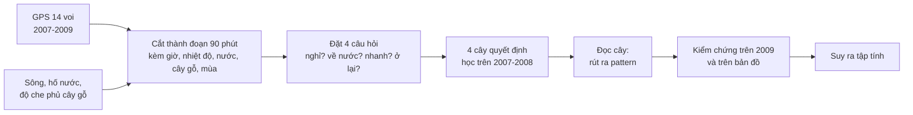

# Voi Kruger: dùng Decision Tree để tìm tập tính di chuyển của voi từ dữ liệu GPS

Dự án môn học Khai phá dữ liệu. Chúng tôi lấy dữ liệu GPS của 14 con voi cái ở Vườn quốc gia Kruger (Nam Phi), nhờ **cây quyết định (Decision Tree)** tự tìm ra các quy luật di chuyển, kiểm tra chúng trên dữ liệu năm sau, rồi từ các quy luật đó **suy ra tập tính của voi** và trình diễn trên bản đồ web.

Dự án dựa trên bài báo: Thaker M, Gupte PR, Prins HHT, Slotow R, Vanak AT (2019). *Fine-scale tracking of ambient temperature and movement reveals shuttling behavior of elephants to water.* Front. Ecol. Evol. 7:4 (file `fevo-07-00004.pdf`).

## Tóm tắt

- **Dữ liệu:** 283.688 điểm GPS của 14 voi trong 2 năm (08/2007–08/2009), cộng thêm vị trí sông và hố nước, độ che phủ cây gỗ, nhiệt độ vòng cổ, mùa.
- **Cách làm:** chia hành trình thành đoạn 90 phút, đặt **bốn câu hỏi** về hành vi (nghỉ? về nước? đi nhanh? ở lại?), mỗi câu một cây quyết định học trên 2007–2008.
- **Phát hiện chính:**
  - Voi **nghỉ tập trung vào khoảng 01:30–04:30 đêm**, khả năng ít di chuyển gấp khoảng 4 lần bình thường.
  - Voi sống theo **chu kỳ khoảng một ngày quanh nguồn nước**: chiều tối rời nước, ban đêm ở xa, sáng quay lại (nhiều nhất 09:00–12:00).
  - Ban ngày voi **đi chậm hơn ở nơi cây gỗ dày**, và nhanh hơn vào mùa mưa.
- **Lưu ý:** cây chỉ thấy các con số hình học. "Voi ngủ", "voi đi uống nước" là **diễn giải của con người**, không phải thứ GPS đo được.

**Xem demo ngay:** mở `elephant_dt/web/index.html` bằng Chrome hoặc Edge (cần Internet để hiện ảnh vệ tinh nền). Không cần cài gì và không cần chạy Python.

## Mục lục

1. [Dự án trả lời câu hỏi gì](#1-dự-án-trả-lời-câu-hỏi-gì)
2. [Dữ liệu gốc có gì](#2-dữ-liệu-gốc-có-gì)
3. [Xử lý dữ liệu](#3-xử-lý-dữ-liệu)
4. [Đặt câu hỏi và nhãn: bốn cây](#4-đặt-câu-hỏi-và-nhãn-bốn-cây)
5. [Cây được tạo ra như thế nào](#5-cây-được-tạo-ra-như-thế-nào)
6. [Kiểm chứng](#6-kiểm-chứng)
7. [Từ cây rút ra pattern](#7-từ-cây-rút-ra-pattern)
8. [Từ pattern phân tích tập tính](#8-từ-pattern-phân-tích-tập-tính)
9. [Kết quả phản ánh điều gì](#9-kết-quả-phản-ánh-điều-gì)
10. [Demo đang diễn giải gì và cách dùng](#10-demo-đang-diễn-giải-gì-và-cách-dùng)
11. [Giới hạn](#11-giới-hạn)
12. [Chạy lại và cấu trúc thư mục](#12-chạy-lại-và-cấu-trúc-thư-mục)
13. [Nguồn](#13-nguồn)

---

## 1. Dự án trả lời câu hỏi gì

> Chỉ từ tọa độ GPS (khoảng 30 phút một điểm) và vài thông tin về môi trường, có tìm ra được voi sống theo nhịp nào không, và nhịp đó có còn đúng ở năm sau không?

Ý tưởng cốt lõi: **không tự đoán** tập tính của voi, mà để một thuật toán đơn giản, đọc được là cây quyết định, tự tìm xem yếu tố nào (giờ, khoảng cách tới nước, cây gỗ, mùa…) liên quan tới hành vi. Chúng tôi đọc các quy luật cây tìm ra, kiểm lại, rồi mới đặt tên cho hành vi.



---

## 2. Dữ liệu gốc có gì

### 2.1 GPS voi (dữ liệu chính)

File `ThermochronTracking Elephants Kruger 2007.csv` từ Movebank. Mỗi dòng là một lần định vị. Chúng tôi dùng 4 cột:

| Cột | Ý nghĩa |
| --- | --- |
| mã voi | AM91, AM93, AM99, AM105, AM107, AM108, AM110, AM239, AM253, AM254, AM255, AM306, AM307, AM308 |
| thời gian | Giờ UTC của lần định vị |
| kinh độ, vĩ độ | Vị trí voi |
| nhiệt độ vòng cổ | Cảm biến gắn trên vòng cổ GPS (°C) |

Quy mô: **283.688 điểm**, 14 voi cái (mỗi voi thuộc một đàn khác nhau), từ 13/08/2007 đến 12/08/2009, khoảng **30 phút một điểm**. Mỗi voi được theo dõi trung bình khoảng 1,5 năm.

### 2.2 Dữ liệu môi trường

| Dữ liệu | Là gì | Nguồn |
| --- | --- | --- |
| **Hố nước** | 124 hố nước đang mở trong vùng nghiên cứu | Kho dữ liệu của tác giả paper (`elemove`) |
| **Sông, suối** | 939 đoạn sông suối, trong đó khoảng 468 đoạn có nước quanh năm, còn lại chỉ có nước theo mùa | Kho dữ liệu của tác giả paper (`elemove`) |
| **Độ che phủ cây gỗ** | Phần trăm diện tích có cây gỗ, độ phân giải khoảng 100 m, từ 0 đến 80% (trung vị khoảng 35%) | Kho code của tác giả. Đây là bề mặt do tác giả nội suy, **không phải** bản đồ gốc |
| **Mặt nước OpenStreetMap** | Hình dạng hồ, sông | OpenStreetMap. **Chỉ để vẽ nền bản đồ**, không dùng để tính |
| **Mùa** | Mùa mưa là 13/10 đến 21/04, còn lại là mùa khô | Quy ước theo lịch. Chúng tôi **không có** số liệu lượng mưa thật |

---

## 3. Xử lý dữ liệu

Cách xử lý chia thành 6 bước. Tên file thực hiện ở mục 12.

### 3.1 Làm sạch GPS
- Bỏ dòng thiếu dữ liệu và dòng trùng (cùng voi, cùng thời điểm).
- Đổi giờ UTC sang **giờ địa phương Nam Phi (UTC+2)**. Mọi giờ trong tài liệu này là giờ địa phương.
- Đổi tọa độ sang **mét** (hệ UTM 36S) để tính khoảng cách chính xác.
- Tính quãng đường giữa hai điểm liên tiếp. Bước nào đòi hỏi tốc độ trên 10 km/h thì coi là lỗi GPS và đánh dấu (chỉ có 4 bước như vậy).

### 3.2 Khoảng cách tới nguồn nước
- Với mỗi điểm GPS, tìm nguồn nước gần nhất và tính khoảng cách thẳng. **Mùa khô** chỉ tính sông có nước quanh năm và hố nước; **mùa mưa** tính thêm sông theo mùa (đúng quy tắc của paper).
- **"Ở vùng nước"** nghĩa là cách nguồn nước không quá **200 m** (đúng ngưỡng của paper). Khoảng 22% điểm GPS nằm trong vùng này.
- Khoảng cách trung bình tới nước: 1,41 km (mùa khô), 0,95 km (mùa mưa).

### 3.3 Độ che phủ cây gỗ
- Lấy giá trị cây gỗ tại điểm GPS, và trung bình trong ô khoảng 300 m quanh điểm.
- Khoảng 6% điểm GPS không có giá trị cây gỗ. Những điểm này được giữ là thiếu (không điền 0), có cờ riêng "thiếu cây gỗ" cho cây biết.

### 3.4 Mùa
Gán mùa mưa hoặc mùa khô theo ngày dương lịch. Mùa mưa có 145.004 điểm, mùa khô có 138.684 điểm (gần bằng nhau, giống paper).

### 3.5 Các "chuyến giữa hai lần ghé nước"
Một **chuyến** là quãng đường voi đi từ lúc rời vùng nước (200 m) tới lúc quay lại vùng nước (khái niệm của paper). Chúng tôi tìm được **2.913 chuyến** (paper: 2.835), và dùng chúng để tính:
- **Thời gian đã rời nước**: voi đã ở ngoài vùng nước bao nhiêu giờ (đặc trưng cho cây).
- Số liệu mô tả: chuyến kéo dài bao lâu, đi bao xa, rời nước và về nước lúc mấy giờ.

### 3.6 Cắt thành cửa sổ 90 phút
Đây là bước tạo ra **bảng dữ liệu để cây học**.

- Mỗi voi được đặt lên các mốc cách nhau 90 phút theo giờ địa phương (00:00, 01:30, 03:00, …, 22:30).
- Mỗi mốc trở thành **một hàng dữ liệu (một mẫu)**: một voi, tại một thời điểm.
- Từ mỗi mốc, nhìn về **phía trước 90 phút** (hoặc 3 giờ ở cây 2) để biết voi sẽ làm gì. Đó là **nhãn (đáp án)** cây cần học.
- Loại các cửa sổ có GPS mất tín hiệu quá lâu hoặc có bước nhảy bất thường, vì sẽ đo sai quãng đường.

Kết quả: **80.487 cửa sổ**, trong đó **75.738** đủ chất lượng.

**Quy tắc quan trọng nhất: không nhìn vào tương lai.**
- **Đặc trưng (đầu vào)** chỉ lấy từ GPS **tại hoặc trước** mốc dự báo (điểm GPS cũ không quá 30 phút).
- **Nhãn (đáp án)** mới lấy từ GPS **sau** mốc đó.
- Cây **không được biết** voi vừa đi bao xa hoặc theo hướng nào. Nếu biết, cây sẽ chỉ học "đang đi thì tiếp tục đi", một kết quả vô nghĩa về hành vi.

Một mẫu trông như thế nào (ví dụ thật):

| Phần | Nội dung |
| --- | --- |
| Đặc trưng (đầu vào) | AM108, 01:30, mùa mưa, nhiệt độ 24°C (giảm 2°C so với 90 phút trước), cách nước 0,86 km, cây gỗ 34% |
| Nhãn (đáp án) | Đường đi 90 phút tới là **29 m**, nên nhãn là **Nghỉ** |

---

## 4. Đặt câu hỏi và nhãn: bốn cây

Một cây chỉ trả lời một câu hỏi hai đáp án. Chúng tôi dùng **bốn cây độc lập**, mỗi cây một khía cạnh hành vi. Mỗi cây lấy **một tập con** các cửa sổ phù hợp với câu hỏi của nó.

| Cây | Câu hỏi | Mẫu nào được dùng | Nhãn được định nghĩa thế nào |
| --- | --- | --- | --- |
| **1. Nghỉ** | Trong 90 phút tới voi nghỉ hay di chuyển? | Mọi cửa sổ | Nghỉ = đi **dưới 75 m** trong 90 phút |
| **2. Về nước** | Voi đang ở xa nước có quay lại vùng nước trong 3 giờ tới không? | Voi đang cách nước **trên 200 m** | Về nước = trong 3 giờ tới có điểm GPS nằm trong vùng 200 m quanh nước |
| **3. Tốc độ** | Ban ngày, khi voi đi, đi nhanh hay chậm? | Ban ngày 06:00–18:00 và voi **đang đi** (từ 75 m) | Nhanh = đi **trên 653 m** trong 90 phút |
| **4. Ở nước** | Voi đang ở trong vùng nước sẽ ở lại hay rời đi? | Voi **đang trong vùng 200 m** quanh nước | Ở lại = đi **dưới 150 m** trong 90 phút |

**Các mốc được chọn thế nào:**
- **75 m (cây 1):** chọn dựa trên khảo sát quỹ đạo. Dưới mức này, quãng đường đo được gần như chỉ là nhiễu GPS (voi đứng yên vẫn "đi" vài chục mét do sai số). Cụ thể: khi đường đi dưới 50 m, độ thẳng của quỹ đạo chỉ khoảng 0,52 (một con voi đứng yên với sai số GPS 10 m cho đường đi cỡ 50 m và độ thẳng khoảng 0,33); từ khoảng 200 m trở lên độ thẳng ổn định quanh 0,94. Ngưỡng 75 m nằm giữa hai mức đó. Đổi ngưỡng trong khoảng 56–94 m thì khoảng 97% nhãn không đổi.
- **653 m (cây 3):** trung vị quãng đường của tập học, nên tập học chia đôi 50/50 nhanh và chậm.
- **150 m (cây 4):** ngưỡng riêng cho voi đang ở vùng nước.
- **200 m (vùng nước):** đúng ngưỡng của paper.

**Số mẫu (học 08/2007–12/2008 / năm 2009) và tỉ lệ nhãn:**

| Cây | Số mẫu học | Số mẫu 2009 | Nhãn hiếm hay đáng chú ý |
| --- | ---: | ---: | --- |
| 1. Nghỉ | 59.207 | 16.517 | Nghỉ chỉ chiếm khoảng 7% (lớp rất hiếm) |
| 2. Về nước | 44.307 | 12.299 | Về nước khoảng 22% |
| 3. Tốc độ | 29.212 | 8.107 | Nhanh khoảng 50% (fit), 35% (validation), 49% (2009) |
| 4. Ở nước | 12.928 | 3.327 | Ở lại khoảng 12–21%. **Ít mẫu nhất** |

**Các đặc trưng đưa vào cây** (10 đặc trưng, thêm "thời gian đã rời nước" cho cây 2 và 3, là 11):

| Đặc trưng | Ý nghĩa |
| --- | --- |
| giờ | Giờ địa phương của mốc dự báo |
| nhiệt độ | Nhiệt độ vòng cổ (°C) |
| mức đổi nhiệt độ | Nhiệt độ hiện tại trừ nhiệt độ 90 phút và 3 giờ trước (cho biết trời đang ấm lên hay lạnh đi) |
| mùa | Mùa mưa hay mùa khô |
| khoảng cách tới nước | Tới nguồn nước gần nhất (km) |
| cây gỗ | Độ che phủ cây gỗ tại điểm GPS và trung bình quanh ~300 m, cờ "thiếu dữ liệu" |
| tuổi điểm GPS | Điểm GPS neo cũ bao nhiêu phút (kiểm soát chất lượng) |
| thời gian đã rời nước | Chỉ cây 2 và 3 dùng. Cây 4 không dùng vì khi voi đang ở vùng nước, giá trị này gần như luôn thiếu |

Giá trị thiếu được thay bằng **trung vị của tập học** (không lấy từ 2009).

**Đặc trưng cho vào và đặc trưng cây thực sự dùng.**

Các đặc trưng hiện trên nút của cây là những đặc trưng cây **thực sự dùng để chia nhánh**. Đó chỉ là một phần trong số đã cho vào, vì cây tự chọn những đặc trưng giúp tách nhãn tốt nhất.

| Cây | Cho vào | Cây dùng để chia nhánh | Cây không dùng |
| --- | --- | --- | --- |
| 1. Nghỉ / di chuyển | 10 | giờ, mùa, nhiệt độ so với 3 giờ trước | nhiệt độ, khoảng cách tới nước, cây gỗ (cả hai loại), nhiệt độ so với 90 phút trước, cờ thiếu cây gỗ, tuổi GPS |
| 2. Về nước | 11 | khoảng cách tới nước, giờ, nhiệt độ so với 3 giờ trước | nhiệt độ, mùa, cây gỗ, thời gian đã rời nước, và các đặc trưng còn lại |
| 3. Nhanh / chậm | 11 | thời gian đã rời nước, khoảng cách tới nước, giờ, cây gỗ (cả hai loại), mùa, nhiệt độ | nhiệt độ thay đổi, cờ thiếu cây gỗ, tuổi GPS |
| 4. Ở lại / rời nước | 10 | giờ, khoảng cách tới nước, cây gỗ, mùa | nhiệt độ, cây gỗ ~300 m, nhiệt độ thay đổi, và các đặc trưng còn lại |

Hai điều cần nói đúng:

- **"Cây không dùng" không có nghĩa là đặc trưng đó vô nghĩa.** Chỉ có nghĩa là trong cây nông này, đặc trưng đó không giúp chia nhãn tốt hơn các đặc trưng đã chọn. Ví dụ ở cây 1, nghỉ gần như do giờ quyết định, nên các đặc trưng khác không còn chỗ.
- **Cây gỗ chỉ xuất hiện trong luật của cây 3 và cây 4.** Cây 1 (nghỉ) và cây 2 (về nước) hoàn toàn không dùng cây gỗ.

---

## 5. Cây được tạo ra như thế nào

### 5.1 Cây quyết định là gì

Cây quyết định là một chuỗi câu hỏi có/không. Mỗi câu hỏi chia dữ liệu làm hai nhánh. Đi từ gốc xuống, trả lời hết các câu hỏi thì tới một **lá** cho ra đáp án. Ví dụ rút gọn của cây "Nghỉ hay di chuyển?":

```
Giờ ≤ 03:45 ?
├── có → Giờ > 00:45 ?
│        ├── có    → NGHỈ                  ← pattern chính (gấp ~4 lần bình thường)
│        └── không → NGHỈ (nhẹ hơn, gấp ~2 lần)
└── không → xét tiếp (phần lớn là DI CHUYỂN)
```

**Một đường từ gốc tới lá chính là một luật**: "nếu mọi điều kiện trên đường đi cùng đúng thì dự đoán nhãn ở lá".

### 5.2 Cách máy học cây

- Dùng thuật toán cây quyết định của thư viện scikit-learn.
- **Cân bằng lớp hiếm:** nhãn "nghỉ" chỉ 7%, nếu để nguyên cây sẽ luôn đoán "di chuyển" cho đạt điểm cao. Chúng tôi bắt cây coi hai lớp quan trọng như nhau (`class_weight="balanced"`).
- **Không để cây quá to:** thử nhiều độ sâu và cỡ lá tối thiểu, đo điểm trên tập validation (2008). Trong các cấu hình điểm gần bằng nhau (chênh dưới 0,01), chọn cây **ít lá nhất**, vì mục đích là cây đọc được.
- Cây cuối cùng được học lại trên toàn bộ dữ liệu 2007–2008.

**Cây thu được:**

| Cây | Độ sâu | Số lá (số luật) |
| --- | ---: | ---: |
| 1. Nghỉ | 3 | 6 |
| 2. Về nước | 4 | 14 |
| 3. Tốc độ | 5 | 17 |
| 4. Ở nước | 3 | 8 |

### 5.3 Từ cây ra bảng luật

Mỗi lá được xuất ra một luật, kèm các con số kiểm tra:

| Chỉ số | Ý nghĩa |
| --- | --- |
| **Số mẫu** | Luật này áp dụng cho bao nhiêu cửa sổ, của bao nhiêu voi |
| **Lift** | Tỉ lệ nhãn trong luật chia cho tỉ lệ chung. Lift 4 là nhãn đó xảy ra gấp 4 lần bình thường; lift gần 1 là luật không có ý nghĩa. Tính riêng cho 2007–2008, validation và 2009 |
| **Số voi cùng xu hướng** | Có bao nhiêu voi (đủ mẫu) cho thấy lift lớn hơn 1 |
| **Ổn định** | Luật "đáng tin" nếu lift trên 1,1 ở cả validation và 2009, **và** lift trên 1 ở ít nhất 2/3 số voi |

Toàn bộ luật của bốn cây xem được trong tab **Luật** của demo web (mục 10).

---

## 6. Kiểm chứng

### 6.1 Chia dữ liệu theo thời gian

| Giai đoạn | Dùng để làm gì |
| --- | --- |
| 08/2007 – 06/2008 (**fit**) | Cây học từ đây |
| 07/2008 – 12/2008 (**validation**) | Chọn độ phức tạp của cây |
| **Năm 2009** | Đối chiếu: pattern tìm ở 2007–2008 còn đúng không |

Chia **theo thời gian** (không xáo trộn ngẫu nhiên), vì mục tiêu là hỏi "quy luật này có giữ được sang năm sau không". Cửa sổ nào có phần "tương lai" chạm sang giai đoạn sau thì bị bỏ khỏi giai đoạn trước, để nhãn không lọt qua ranh giới. Ở 2009 chỉ giữ voi có ít nhất 16 cửa sổ (còn **11 voi**).

**Nói thẳng:** năm 2009 đã được xem ở các phiên bản trước của dự án, nên đây là **phép đối chiếu**, không phải bài kiểm tra mù hoàn toàn. Cấu hình cuối chỉ chọn dựa vào validation.

### 6.2 So với "đối thủ ngây thơ"

Đối thủ là mô hình **luôn đoán lớp đông nhất** (ví dụ luôn đoán "di chuyển"). Mô hình này có độ chính xác (accuracy) rất cao (93% ở cây 1) nhưng vô dụng. Vì vậy chúng tôi chấm bằng **macro-F1** (từ 0 đến 1, tính cả hai lớp như nhau, kể cả lớp hiếm).

| Cây | Cây quyết định (validation / 2009) | Đối thủ ngây thơ (validation / 2009) |
| --- | --- | --- |
| 1. Nghỉ | 0,61 / 0,60 | 0,48 / 0,48 |
| 2. Về nước | 0,70 / 0,69 | 0,44 / 0,43 |
| 3. Tốc độ | 0,57 / 0,62 | 0,39 / 0,34 |
| 4. Ở nước | 0,63 / 0,60 | 0,44 / 0,46 |

**Đọc kết quả:** cây thắng đối thủ ở cả bốn câu hỏi và điểm gần như giữ nguyên từ validation sang 2009 (tức không học vẹt). Nhưng điểm chỉ ở mức trung bình, vì hành vi động vật có nhiều lý do mà GPS không thấy. Mục tiêu của dự án là **hiểu**, không phải đạt điểm cao nhất.

### 6.3 Thử bỏ từng nhóm đặc trưng

Bỏ lần lượt từng nhóm đặc trưng rồi xem điểm giảm bao nhiêu, để biết cây thực sự dựa vào đâu:
- **Cây 1:** bỏ giờ thì điểm rơi từ 0,61 xuống 0,49; bỏ nhóm khác gần như không đổi. Nghỉ là chuyện của đồng hồ.
- **Cây 2:** bỏ khoảng cách tới nước thì điểm rơi từ 0,70 xuống 0,57. Đây là yếu tố mạnh nhất (nhưng hiển nhiên).
- **Cây 3:** bỏ từng nhóm đều không đổi nhiều; cây dựa vào nhiều tín hiệu yếu cộng lại.
- **Cây 4:** bỏ giờ thì điểm rơi từ 0,63 xuống 0,54.

### 6.4 Pattern phải qua ba lần kiểm

Một pattern chỉ được coi là đáng tin khi:
1. đúng ở **validation (2008) và năm 2009**,
2. đúng với **đa số voi** (không chỉ vài con),
3. được **số liệu mô tả** đếm lại độc lập với cây xác nhận.

---

## 7. Từ cây rút ra pattern

**Pattern** là một luật của cây vừa mạnh, vừa ổn định. Cách chọn:
1. Liệt kê các luật (lá) và lift của từng luật.
2. Giữ luật "đáng tin" (đạt cả ba lần kiểm ở mục 6.4).
3. Chọn luật nổi bật nhất. Với cây 2, 3, 4 là luật đáng tin xếp cao nhất theo lift ở 2009 và số mẫu. Với cây 1 là luật có lift cao nhất (00:45–03:45).
4. Dùng số liệu mô tả (đếm theo giờ, mùa, cây gỗ, từng voi…) để kiểm lại.

**Bốn pattern rõ nhất (cây tìm ra):**

| Cây | Luật (pattern) | Số mẫu | Lift (học / validation / 2009) | Voi cùng xu hướng (2007–08 · 2009) |
| --- | --- | ---: | --- | --- |
| **1. Nghỉ** | 00:45 < giờ ≤ 03:45 → **nghỉ** | 6.817 | 4,74 / 3,63 / 4,62 | 14/14 · 10/10 |
| **2. Về nước** | cách nước ≤ 540 m, 03:45 < giờ ≤ 17:15 → **về nước** | 5.500 | 2,99 / 2,96 / 2,62 | 14/14 · 11/11 |
| **3. Tốc độ** | mùa khô, trước 14:15, cây gỗ ≤ 45%, đã rời nước 5,5–15 giờ → **đi chậm** | 4.322 | 1,32 / 1,18 / 1,31 | 14/14 · 9/9 |
| **4. Ở nước** | 00:45 < giờ ≤ 03:45, cây gỗ > 37% → **ở lại** | 398 | 5,21 / 2,93 / 4,03 | 5/5 · (quá ít mẫu) |

**Mạnh nhất là cây 1 và cây 2.** Pattern cây 3 là tín hiệu yếu (lift 1,3) nhưng đúng ở mọi voi; luật mạnh nhất của cây 3 liên quan cây gỗ: "mùa khô, trước 14:15, cây gỗ > 45% → đi chậm" (lift 1,4–1,6). Pattern cây 4 dựa trên rất ít mẫu, bằng chứng yếu nhất.

---

## 8. Từ pattern phân tích tập tính

Mỗi tập tính được suy ra theo **ba bước**, mỗi bước có tên để không lẫn:

| Bước | Ví dụ với cây 1 | Ai làm |
| --- | --- | --- |
| **Cây tìm ra** | "Từ 00:45 đến 03:45, khả năng voi ít di chuyển gấp khoảng 4 lần bình thường" | Cây quyết định |
| **Số liệu mô tả** | "67% các lần nghỉ nằm ở 00:00–04:30; nghỉ gần như không đổi dù voi ở gần hay xa nước" | Chúng tôi đếm thêm trên cùng dữ liệu |
| **Diễn giải** | "Voi đang ngủ hoặc nghỉ ngơi" | Con người, ghi rõ là giả thuyết |

**Quy ước số liệu trong mục này.**
- Một mẫu là một cửa sổ 90 phút trên lưới 90 phút (00:00, 01:30, 03:00, …). Giờ ghi trong bảng là **giờ bắt đầu cửa sổ**, nhãn nói về 90 phút *sau* mốc đó. "Mốc 03:00" nghĩa là trạng thái của voi trong khoảng 03:00–04:30 (cây 2 nhìn tới 3 giờ).
- "học" là 08/2007–12/2008, "2009" là năm đối chiếu. Một pattern đáng tin khi giữ nguyên ở cả hai, và có ở đa số voi.
- Số liệu "cây tìm ra" lấy từ bảng luật của cây. Số liệu "mô tả" là chúng tôi đếm thêm trên cùng dữ liệu (do `09_behavior_stats.py` tính), nên có thể chi tiết hơn cây.

### 8.1 Cây 1: Nghỉ hay di chuyển (nhịp nghỉ, ngủ)

#### 8.1.1 Cây tìm ra gì

| Luật | Mẫu | Lift (học / val / 2009) | Voi lift > 1 (2007–08 · 2009) |
| --- | ---: | --- | --- |
| 00:45 < giờ ≤ 03:45 → **nghỉ** | 6.817 | 4,74 / 3,63 / 4,62 | 14/14 · 10/10 |
| giờ ≤ 00:45 → nghỉ | 3.705 | 2,04 / 1,92 / 2,03 | 14/14 · 7/9 |
| giờ > 20:15 và nhiệt độ so với 3 giờ trước > −3,5 °C → nghỉ | 2.561 | 1,34 / 1,29 / 0,87 | 10/14 · 4/9 (chưa ổn định) |
| 03:45 < giờ ≤ 20:15 → di chuyển (cả mùa khô lẫn mùa mưa) | ~41.000 | ~1,05 | 14/14 · 10/10 |

Cây chỉ thực sự dùng **giờ**; bỏ giờ thì macro-F1 rơi từ 0,61 xuống 0,49, còn bỏ mùa, nước, cây gỗ, nhiệt độ gần như không đổi. Nghĩa là **nghỉ là chuyện của đồng hồ, không phải chuyện của chỗ ở**.

#### 8.1.2 Số liệu đi sâu

**a. Nhịp theo giờ.** Tỉ lệ cửa sổ "nghỉ" theo giờ bắt đầu:

| Giờ bắt đầu | 22:30 | 00:00 | 01:30 | 03:00 | 04:30 | 06:00 | 12:00 | 15:00 | 18:00 |
| --- | ---: | ---: | ---: | ---: | ---: | ---: | ---: | ---: | ---: |
| học | 9,2% | 15,8% | 29,9% | **38,2%** | 7,3% | 0,9% | 4,5% | 1,4% | 1,9% |
| 2009 | 6,3% | 13,7% | 25,6% | **36,8%** | 9,3% | 1,2% | 2,8% | 0,4% | 1,5% |

Hình dạng: nghỉ tăng dần từ khoảng 22:30, đạt đỉnh ở mốc 03:00 (khoảng 03:00–04:30), rồi **rơi đột ngột** sang mốc 04:30 (38% → 7%). 67% số cửa sổ nghỉ của cả dữ liệu (74% ở 2009) rơi vào bốn mốc 00:00–04:30. Ban ngày (06:00–18:00) nghỉ chỉ 2,4% (2009: 1,6%).

**b. Nghỉ ban đêm ít hơn người ta tưởng.** Ngay trong khung vàng, voi cũng **không nghỉ phần lớn thời gian**: chỉ 30–38% cửa sổ nghỉ. Xét từng đêm của từng voi (đêm có đủ 4 cửa sổ 00:00–06:00): 66% đêm có ít nhất một cửa sổ nghỉ, 22% đêm có từ hai cửa sổ nghỉ trở lên, **34% đêm không có cửa sổ nghỉ nào** (2009: 60% / 19% / 40%). Pattern là xu hướng thống kê, không phải "đêm nào voi cũng nghỉ".

**c. Mỗi đợt nghỉ ngắn.** Đợt nghỉ = các cửa sổ nghỉ liên tiếp.

| Số cửa sổ liên tiếp | 1 (≈ 1,5 giờ) | 2 (≈ 3 giờ) | 3 | ≥ 4 |
| --- | ---: | ---: | ---: | ---: |
| Tỉ lệ đợt (học) | 79,7% | 17,4% | 2,4% | 0,5% |
| Tỉ lệ đợt (2009) | 80,0% | 17,5% | 2,4% | 0 |

Đợt dài nhất chỉ 5 cửa sổ (khoảng 7,5 giờ), và chỉ vài lần. Trong các ngày có đủ dữ liệu cả 16 cửa sổ, tổng thời gian "nghỉ" trung vị khoảng **1,5 giờ/ngày**, trung bình 2,0 giờ (học) và 1,6 giờ (2009). Lưu ý: cửa sổ nằm trên lưới 90 phút nên các con số này thô, và chỉ tính những ngày GPS đủ liền mạch (1.799 ngày-voi học, 332 ngày-voi 2009).

**d. Nghỉ có gắn với nước không? Không.** Ban đêm (00:00–06:00), tỉ lệ nghỉ theo khoảng cách tới nước gần như phẳng:

| Cách nước | ≤ 0,2 km | 0,2–0,5 | 0,5–1 | 1–2 | > 2 km |
| --- | ---: | ---: | ---: | ---: | ---: |
| học | 22,4% | 21,8% | 21,2% | 23,6% | 23,0% |
| 2009 | 21,5% | 22,4% | 23,8% | 20,7% | 18,1% |

Hơn nữa phần lớn cửa sổ ban đêm nằm **xa** nước (khoảng 87% cửa sổ 00:00–06:00 cách nước hơn 200 m). Voi nghỉ ở chỗ nó đang đứng, không đi tới nước để nghỉ.

**e. Mùa.** Trong khung 00:45–03:45: mùa khô 34,9% và mùa mưa 33,0% (học); 27,7% và 34,3% (2009). Không có khác biệt ổn định.

**f. Cây gỗ (không do cây tìm ra, đây là phân tích mô tả).** Ban đêm, cây gỗ tại điểm GPS càng dày thì tỉ lệ nghỉ nhìn chung càng cao (ở 2009 nhóm 0–15% cao hơn nhóm 15–30%, nên không đều):

| Cây gỗ (%) | 0–15 | 15–30 | 30–45 | 45–60 | > 60 |
| --- | ---: | ---: | ---: | ---: | ---: |
| học | 17,4% | 19,2% | 22,8% | 29,9% | 38,1% (n = 63) |
| 2009 | 18,8% | 13,3% | 24,0% | 30,5% | 46,2% (n = 13) |

Xu hướng chung cùng chiều nhưng hai nhóm cao nhất có ít mẫu. Cây không dùng đặc trưng này vì thêm nó không cải thiện dự đoán.

**g. Nhiệt độ.** Ban ngày (09:00–15:00) nhiệt độ từ dưới 25 đến trên 40 °C gần như không đổi tỉ lệ nghỉ (2–5%). Nhiệt độ liên quan tới nghỉ chủ yếu vì nó đi cùng giờ (đêm mát, ngày nóng).

**h. Khác biệt giữa từng voi.** Tỉ lệ nghỉ trong khung 00:45–03:45 dao động từ 16,7% (AM105) đến 43,7% (AM108) ở dữ liệu học, và từ 15,9% (AM107) đến 48,0% (AM108) năm 2009. AM108 và AM254 luôn thuộc nhóm nghỉ nhiều, AM105 luôn nghỉ ít; nhưng AM107 từ 32% xuống 16%, tức khác biệt cá thể có phần không ổn định. Cây không dùng danh tính voi nên khác biệt này không nằm trong luật.

**i. Một chi tiết nhỏ ban ngày.** Mốc 10:30–12:00 có một chỗ nhô nhẹ (4,3% nghỉ, so với ~1–2% buổi sáng sớm và chiều muộn). Có thể là nghỉ giữa trưa lúc nóng, nhưng chỗ nhô này nhỏ và yếu hơn ở 2009 (3,2%), chỉ nên coi là gợi ý.

#### 8.1.3 Diễn giải thành tập tính

1. **Voi có một "cửa sổ nghỉ" ban đêm khá hẹp**, tập trung khoảng 01:30–04:30, đỉnh 03:00–04:30. Pattern giữ nguyên ở cả hai giai đoạn và ở đa số voi.
2. **Kết thúc nghỉ rất dứt khoát lúc 04:30–06:00**: tỉ lệ nghỉ rơi từ 38% xuống 7% trong một mốc 90 phút. Voi dậy và bắt đầu đi trước khi trời sáng hẳn (mặt trời ở Kruger mọc khoảng 05:00–07:00 tùy mùa; số này là kiến thức chung, không nằm trong dữ liệu).
3. **Nghỉ ngắn và vụn**: khoảng 80% đợt nghỉ chỉ dài một cửa sổ. Ước lượng thô khoảng 1,5–2 giờ "ít di chuyển" mỗi ngày. Nếu một số nghiên cứu khác ghi nhận voi hoang dã ngủ rất ít (cỡ vài giờ mỗi ngày, ví dụ Gravett và cộng sự 2017, PLoS ONE), kết quả này không mâu thuẫn. **Cần kiểm lại nguồn trước khi trích dẫn.**
4. **Nghỉ không phụ thuộc có ở gần nước hay không**, cũng không khác theo mùa. Có xu hướng nghỉ nhiều hơn ở nơi cây gỗ dày (có thể là chỗ kín, có bóng cây; giả thuyết).
5. **Ban ngày voi hầu như luôn di chuyển** (97,6% cửa sổ có đi từ 75 m trở lên), dù trời nóng.

#### 8.1.4 Không nói được

- Không nói "voi ngủ". GPS chỉ cho thấy voi ít di chuyển; voi có thể đứng ngủ, đứng nghỉ, ăn tại chỗ hay cảnh giới. Cách nói an toàn: "voi **ít di chuyển**, có thể là ngủ hoặc nghỉ ngơi".
- Không nói "voi ngủ khoảng 2 giờ". Con số 1,5–2 giờ chỉ là thời gian GPS gần như đứng yên theo lưới 90 phút.
- Không nói "mỗi đêm voi nghỉ". Một phần ba số đêm không có cửa sổ nghỉ nào.
- Không nói cây gỗ làm voi nghỉ nhiều hơn.

### 8.2 Cây 2: Có quay lại nước không (nhịp đi uống nước)

Chỉ xét cửa sổ mà voi đang cách nước hơn 200 m. Nhãn "về nước" = trong 3 giờ tới có một điểm GPS nằm trong vùng 200 m quanh nguồn nước. Tỉ lệ chung khoảng 22–24%.

#### 8.2.1 Cây tìm ra gì

| Luật | Mẫu | Lift (học / val / 2009) | Voi lift > 1 (2007–08 · 2009) |
| --- | ---: | --- | --- |
| cách nước ≤ 540 m, 03:45 < giờ ≤ 17:15 → **về nước** | 5.500 | 2,99 / 2,96 / 2,62 | 14/14 · 11/11 |
| cách nước 540–800 m, 03:45 < giờ ≤ 17:15 → về nước | 3.052 | 2,05 / 1,86 / 1,83 | 14/14 · 9/9 |
| cách nước ≤ 460 m, giờ > 17:15 → về nước | 2.095 | 2,06 / 1,83 / 1,63 | 13/13 · 9/9 |
| cách nước ≤ 440 m, giờ ≤ 03:45 → về nước | 1.134 | 1,49 / 1,39 / 1,38 | 12/13 · 4/6 |
| cách nước 0,8–1,2 km, nhiệt độ **tăng** hơn 0,5 °C so với 3 giờ trước → về nước | 2.025 | 1,53 / 1,63 / 1,43 | 13/14 · 6/7 |
| cách nước > 2,8 km (nhiệt độ không tăng) → chưa về nước | 4.216 | 1,27 / 1,26 / 1,31 | 12/12 · 6/6 |

Bỏ khoảng cách tới nước thì macro-F1 rơi từ 0,70 xuống 0,57: đây là yếu tố mạnh nhất. Bỏ nhiệt độ rơi xuống 0,65, bỏ giờ xuống 0,67. Mùa và cây gỗ không giúp thêm.
Chú ý: đặc trưng nhiệt độ mà cây dùng là **mức thay đổi trong 3 giờ qua**, nên nó mô tả "trời đang ấm lên" (buổi sáng), không phải nhiệt độ tuyệt đối.

#### 8.2.2 Số liệu đi sâu

**a. Khoảng cách: hiển nhiên nhưng có thể đo.** Xác suất về nước trong 3 giờ theo khoảng cách tới nước (mọi giờ):

| Cách nước | 0,2–0,3 km | 0,3–0,6 | 0,6–1 | 1–2 | 2–4 | > 4 km |
| --- | ---: | ---: | ---: | ---: | ---: | ---: |
| học | 63,7% | 43,7% | 24,4% | 13,0% | 4,4% | 0,9% |
| 2009 | 62,4% | 45,0% | 26,3% | 13,7% | 5,0% | 2,1% |

Xác suất giảm rất nhanh khi xa nước: khoảng 44% ở cỡ 0,5 km, 13% ở 1–2 km, 4–5% ở 2–4 km. Voi hiếm khi đi tới nước trong 3 giờ từ cách trên 2 km.

**b. Giờ: đây mới là phần "tập tính".** Cố định khoảng cách 0,3–1,5 km để so sánh công bằng:

| Giờ bắt đầu | 00:00 | 01:30 | 03:00 | 04:30 | 06:00 | 07:30 | 09:00 | 10:30 | 12:00 | 13:30 | 15:00 | 16:30 | 18:00 | 19:30 | 21:00 | 22:30 |
| --- | ---: | ---: | ---: | ---: | ---: | ---: | ---: | ---: | ---: | ---: | ---: | ---: | ---: | ---: | ---: | ---: |
| học | 10% | 6% | 11% | 25% | 35% | 43% | 48% | **48%** | 45% | 42% | 43% | 38% | 26% | 18% | 16% | 14% |
| 2009 | 12% | 8% | 9% | 27% | 40% | 40% | 52% | **55%** | 52% | 45% | 43% | 31% | 30% | 22% | 18% | 12% |

Hình dạng: rất thấp giữa đêm (6–12% ở các mốc 00:00–03:00), bắt đầu leo từ 04:30, **đỉnh vào buổi sáng 09:00–12:00**, giữ cao đến 15:00 rồi giảm dần về tối. Gộp lại: ban ngày (06–18h) 42,5% (2009: 44,5%), ban đêm (18–06h) chỉ 15,9% (2009: 17,6%), cùng khoảng cách.

**c. Chu kỳ một chuyến đi (từ hai lần ghé nước liên tiếp).** Có 2.913 chuyến của 14 voi (2007–2009).

| | Mùa khô | Mùa mưa |
| --- | ---: | ---: |
| Số chuyến | 1.500 | 1.413 |
| Thời lượng trung vị | 22,0 giờ | 19,0 giờ |
| Đường đi trung vị | 7,3 km | 7,9 km |
| Xa nước nhất (trung vị) | 2,2 km | 1,8 km |

| Khung giờ | 00–03 | 03–06 | 06–09 | 09–12 | 12–15 | 15–18 | 18–21 | 21–24 |
| --- | ---: | ---: | ---: | ---: | ---: | ---: | ---: | ---: |
| Giờ **rời** nước | 6% | 2% | 4% | 5% | 14% | **31%** | **26%** | 12% |
| Giờ **về** nước | 2% | 3% | 17% | **26%** | 22% | 15% | 10% | 5% |

57% số chuyến **rời** nước vào lúc 15:00–21:00; 65% số chuyến **về** nước vào lúc 06:00–15:00. Một chuyến điển hình kéo dài cỡ một ngày (19–22 giờ), đi khoảng 7–8 km nhưng chỉ cách nước tối đa khoảng 2 km: voi **đi vòng quanh nguồn nước**, không đi xa rồi mới quay về.

**d. Nóng lên thì về nước nhiều hơn, nhưng tác động khiêm tốn.** Ban ngày (06–18h), cách nước 0,3–1,5 km:

| Nhiệt độ vòng cổ | ≤ 25 °C | 25–30 | 30–35 | > 35 |
| --- | ---: | ---: | ---: | ---: |
| học | 36,4% | 43,3% | 44,9% | 46,3% |
| 2009 | 36,2% | 50,2% | 48,6% | 43,7% |

Từ ≤ 25 lên 25–30 °C xác suất tăng 7–14 điểm, sau đó **không tăng thêm** (năm 2009 còn giảm nhẹ ở > 35 °C). Dạng "bậc thang rồi bằng" chứ không phải càng nóng càng về nước. Nhớ rằng nhiệt độ vòng cổ đi cùng giờ trong ngày.

**e. Mùa.** Cùng khoảng cách 0,3–1,5 km, mùa mưa về nước nhiều hơn mùa khô: 31,2% so với 23,8% (học), 34,8% so với 24,8% (2009). Ngược với trực giác "mùa khô khát hơn". Giả thuyết: mùa mưa có nhiều vũng nước nhỏ nên voi ghé nước thường hơn và đổi nguồn nhanh; hoặc "nguồn nước gần nhất" thay đổi theo mùa nên cùng khoảng cách mà ý nghĩa khác nhau. Chưa kiểm.

**f. Đã rời nước bao lâu.**

| Đã rời nước | < 3 giờ | 3–6 | 6–12 | 12–24 | 24–48 | > 48 |
| --- | ---: | ---: | ---: | ---: | ---: | ---: |
| học | 28,0% | 19,8% | 24,2% | **42,6%** | 28,2% | 22,6% |
| 2009 | 30,6% | 23,5% | 26,1% | **44,7%** | 29,4% | 26,2% |

Đỉnh ở 12–24 giờ sau khi rời nước, khớp với chu kỳ cỡ một ngày. Không có dấu hiệu "càng lâu không uống càng khát": đã ngoài 24 giờ thì xác suất về nước **giảm**. Nhưng 12–24 giờ sau chuyến rời nước chiều tối chính là sáng hôm sau, nên kết quả này phần lớn là hiệu ứng giờ trong ngày.

#### 8.2.3 Diễn giải thành tập tính

1. **Voi có nhịp đi uống nước theo ngày**: rời nước vào chiều tối (15:00–21:00), ở lại xa nước qua đêm, về nước từ khoảng 06:00 và nhiều nhất vào buổi sáng (09:00–12:00). Chu kỳ khoảng một ngày. Đây là cùng bức tranh "shuttling" mà paper mô tả (chu kỳ đỉnh 10–30 giờ; rời nước khoảng 13:00–14:00 và về khoảng 10:00–11:00 theo trung bình của paper). Con số của chúng tôi lệch đôi chút (rời muộn hơn) nhưng cùng hình dạng, vì định nghĩa chuyến và cách tính khác nhau.
2. **Ban đêm voi ít chủ động đi tới nước**: 6–12% cho ba mốc giữa đêm, so với 45–55% buổi sáng. Voi chỉ ghé nước ban đêm khi đã ở rất gần (≤ 460 m).
3. **Voi sống quanh nước trong bán kính khoảng 2 km**: chuyến điển hình đi 7–8 km nhưng xa nước nhất khoảng 2 km.
4. **Nhiệt độ có tác động nhỏ**: buổi sáng trời ấm dần thì voi cách nước 0,8–1,2 km có xu hướng đi về nước. Paper nhấn mạnh nhiệt độ là động lực chính; dữ liệu của chúng tôi chỉ ủng hộ ở mức khiêm tốn và thấy rõ nhất khi so với trời mát.

#### 8.2.4 Không nói được

- Không nói "voi đi uống nước". Cây chỉ biết voi **vào vùng 200 m quanh nước**. Có thể voi uống, tắm, bôi bùn, hoặc chỉ đi dọc sông (vùng 200 m quanh các đoạn sông dài rất rộng).
- Không nói "voi khát". Không có đo lượng nước hay mất nước.
- Không nói "nóng là nguyên nhân". Nhiệt độ vòng cổ đi cùng giờ, và hiệu ứng bão hòa.
- Không rút kết luận "mùa khô voi khát hơn mùa mưa": dữ liệu cho kết quả ngược lại và chưa giải thích được.
- Khoảng cách tới nước là yếu tố mạnh nhất nhưng hiển nhiên; không nên coi đây là phát hiện.

### 8.3 Cây 3: Đi nhanh hay chậm (cách voi di chuyển ban ngày)

Chỉ xét ban ngày (06:00–18:00) và khi voi có đi (≥ 75 m trong 90 phút; 97,6% cửa sổ ban ngày thỏa). "Nhanh" = đường đi > 653 m / 90 phút (trung vị của tập fit). Đây là cây yếu nhất về độ chính xác: macro-F1 0,57 (val) và 0,62 (2009), so với 0,39 và 0,34 khi luôn đoán một lớp.

Tốc độ trung bình khi voi đi cỡ 0,4 km/giờ (trung vị 585 m / 90 phút ở dữ liệu học, 640 m ở 2009). Paper báo cáo tốc độ trung bình 0,4 km/giờ, cùng cỡ.

**Một điểm cần nhớ:** ngưỡng "nhanh" cố định theo tập fit, nên tỉ lệ nhanh khác nhau giữa các giai đoạn (fit ≈ 50%, validation ≈ 35%, 2009 ≈ 49%). Khi so sánh "học" với "2009", chiều hướng quan trọng hơn con số tuyệt đối.

#### 8.3.1 Cây tìm ra gì

| Luật | Mẫu | Lift (học / val / 2009) | Voi lift > 1 (2007–08 · 2009) |
| --- | ---: | --- | --- |
| mùa khô, trước 14:15, cây gỗ ~300 m > 45% → **chậm** | 1.039 | 1,44 / 1,33 / 1,62 | 10/10 · 4/4 |
| mùa khô, trước 14:15, cây gỗ ≤ 45%, đã rời nước 5,5–15 giờ → chậm | 4.322 | 1,32 / 1,18 / 1,31 | 14/14 · 9/9 |
| mùa mưa, cây gỗ ≤ 35%, cách nước > 310 m, đã rời nước ≤ 3,7 giờ → **nhanh** | 1.258 | 1,49 / 1,93 / 1,56 | 8/8 · 6/6 |
| mùa mưa, cây gỗ ≤ 35%, cách nước 80–310 m → nhanh | 1.388 | 1,19 / 1,37 / 1,37 | 9/11 · 4/5 |
| mùa mưa, cây gỗ > 35%, sau 14:15 → nhanh | 1.944 | 1,16 / 1,34 / 1,22 | 10/13 · 4/4 |

Cả mùa, cây gỗ, giờ và thời gian đã rời nước đều xuất hiện trong cây; bỏ từng nhóm đều không thay đổi nhiều (± 0,02). Cây tốc độ dựa vào **nhiều tín hiệu yếu cộng lại** hơn là một tín hiệu mạnh.

#### 8.3.2 Số liệu đi sâu

**a. Cây gỗ: tín hiệu rõ nhất và nhất quán nhất.** Tỉ lệ đi nhanh theo độ che phủ cây gỗ trong ~300 m quanh voi:

| Cây gỗ ~300 m | 0–25% | 25–35% | 35–45% | > 45% |
| --- | ---: | ---: | ---: | ---: |
| học | 53,5% | 49,7% | 41,9% | 34,1% |
| 2009 | 69,9% | 51,9% | 41,3% | 29,9% |

Giảm đều theo độ dày cây gỗ, ở cả hai giai đoạn. Và hiệu ứng **có trong cả hai mùa**:

| Cây gỗ ~300 m | mùa khô (học / 2009) | mùa mưa (học / 2009) |
| --- | --- | --- |
| ≤ 35% | 40,0% / 46,5% | 61,2% / 71,8% |
| 35–45% | 35,1% / 26,5% | 49,3% / 54,6% |
| > 45% | 23,4% / 20,2% | 42,3% / 41,3% |

**b. Mùa: lớn nhất.** Tỉ lệ đi nhanh: mùa khô 35,7% (2009: 36,2%), mùa mưa 53,4% (2009: 61,2%). Mùa mưa voi đi nhanh hơn rõ rệt. Paper cũng báo cáo mùa mưa nhanh hơn một chút (0,42 so với 0,39 km/giờ) và gợi ý do voi gặm cỏ nhiều hơn là hái lá, nhưng đó là giả thuyết của tác giả, chúng tôi không kiểm.

**c. Giờ trong ngày: sáng đều, chiều tăng tốc.**

| Giờ bắt đầu | 06:00 | 07:30 | 09:00 | 10:30 | 12:00 | 13:30 | 15:00 | 16:30 |
| --- | ---: | ---: | ---: | ---: | ---: | ---: | ---: | ---: |
| học | 40,8% | 41,8% | 42,9% | 42,7% | 41,3% | 42,1% | 49,3% | **55,7%** |
| 2009 | 47,9% | 49,0% | 46,2% | 48,7% | 46,7% | 46,2% | 52,1% | **55,8%** |

Phẳng từ sáng tới 13:30 rồi tăng mạnh từ 15:00 và cao nhất lúc 16:30. Khung giờ này trùng với lúc phần lớn chuyến **rời nước** bắt đầu (15:00–21:00, xem Cây 2).

**d. Đã rời nước bao lâu (mùa khô có dạng chữ U).**

| Đã rời nước | < 3 giờ | 3–6 | 6–15 | > 15 giờ |
| --- | --- | --- | --- | --- |
| mùa khô (học / 2009) | 45,1% / 38,7% | 36,0% / 34,3% | **29,1% / 31,7%** | 39,8% / 41,0% |
| mùa mưa (học / 2009) | 61,1% / 66,1% | 55,5% / 58,5% | 51,9% / 61,2% | 54,1% / 62,5% |

Mùa khô: vừa rời nước thì đi nhanh, giữa chuyến (6–15 giờ) chậm nhất, về cuối chuyến (> 15 giờ) lại nhanh. Mùa mưa gần như phẳng.

**e. Nhiệt độ.** ≤ 25 °C: 37,5% (2009: 38,8%); 25–30 °C: 45,3% (55,2%); 30–35 °C: 46,7% (50,9%); > 35 °C: 48,7% (52,4%). Nóng hơn thì đi nhanh hơn, tác động nhỏ. Nhiệt độ cũng đi cùng giờ và mùa.

#### 8.3.3 Diễn giải thành tập tính

1. **Voi đi chậm hơn ở nơi cây gỗ dày** và nhanh hơn ở nơi thưa, ở cả hai mùa và cả hai giai đoạn. Cách hiểu hợp lý: đi chậm lại để ăn hoặc đứng dưới bóng cây; qua chỗ trống thì đi nhanh. Paper cũng báo cáo tốc độ thấp hơn ở nơi nhiều cây và cho rằng voi đang kiếm ăn hoặc tìm bóng.
2. **Voi đi nhanh hơn vào mùa mưa.** Ở đây trùng với paper.
3. **Chiều tối voi tăng tốc**, cùng lúc voi rời nguồn nước. Hợp với việc đi tới khu kiếm ăn sau khi đã ở gần nước giữa ngày.
4. **Mùa khô có nhịp "đi nhanh rời nước, đi chậm kiếm ăn xa, đi nhanh trở lại"** (dạng U). Đây là giả thuyết đẹp nhưng chỉ có một luật hỗ trợ (4.322 mẫu) và mức tăng nhỏ, nên chỉ nên nêu như gợi ý.
5. **Ban ngày voi hầu như luôn đi, nhưng đi chậm** (~0,4 km/giờ, hợp với việc vừa đi vừa ăn).

Paper còn báo cáo voi đi nhanh nhất lúc vừa rời nước và lúc tới gần nước, chậm nhất ở giữa chuyến; dữ liệu 90 phút của chúng tôi chỉ thấy lờ mờ điều này (dạng U ở mùa khô), vì cửa sổ dài và có nhiều giờ trong ngày bị gộp.

#### 8.3.4 Không nói được

- Không nói "voi đi chậm để kiếm ăn". GPS chỉ cho thấy đường đi ngắn; còn có thể là đứng bóng, nghỉ ngắn, đàn con đi chậm.
- Không nói "cây gỗ làm voi chậm lại" (liên hệ, không phải nhân quả). Cây gỗ ~300 m quanh voi cũng có thể phản ánh loại đất, cỏ, độ dốc.
- Không nói "mùa mưa voi đi nhanh vì ...": chúng tôi không có dữ liệu thức ăn. Mùa lại là mốc theo lịch.
- Độ chính xác của cây này thấp (macro-F1 ~0,6), nên đọc pattern chung, không nên tin từng dự đoán cụ thể.

### 8.4 Cây 4: Ở lại hay rời vùng nước (voi làm gì khi đã ở nước)

Chỉ xét cửa sổ mà voi đang trong vùng 200 m quanh nước. "Ở lại" = đi dưới 150 m trong 90 phút tới. Đây là cây có **ít mẫu nhất** (khoảng 12.900 cửa sổ học gồm fit và validation, 3.327 cửa sổ 2009) và bằng chứng yếu nhất ở cấp độ từng voi. Tỉ lệ ở lại chung khoảng 12–21%.

#### 8.4.1 Cây tìm ra gì

| Luật | Mẫu | Lift (học / val / 2009) | Voi lift > 1 (2007–08) |
| --- | ---: | --- | --- |
| 00:45 < giờ ≤ 03:45, cây gỗ tại GPS > 36,7% → **ở lại** | 398 | 5,21 / 2,93 / 4,03 | 5/5 |
| 00:45 < giờ ≤ 03:45, cây gỗ ≤ 36,7% → ở lại | 454 | 3,62 / 2,39 / 3,45 | 6/6 |
| giờ ≤ 00:45, cách nước ≤ 60 m → ở lại | 278 | 3,16 / 2,37 / 2,41 | 2/2 |
| giờ ≤ 00:45, cách nước > 60 m → ở lại | 276 | 2,26 / 1,54 / 2,18 | 2/2 |
| giờ > 03:45, mùa khô, cây gỗ > 37% → ở lại | 2.281 | 1,08 / 1,28 / 1,34 | 11/13 |

Bỏ giờ thì macro-F1 rơi từ 0,63 xuống 0,54; các nhóm khác gần như không đổi. Nghĩa là **cây này chủ yếu học "ban đêm thì ở lại"**. Cột "voi lift > 1" cho 2009 hầu như trống (0/0) vì mỗi voi có quá ít cửa sổ ban đêm trong vùng nước để đánh giá; chỉ có thể nói tổng thể, không nói được "đa số voi".

#### 8.4.2 Số liệu đi sâu

**a. Giờ.** Trong số các cửa sổ voi đang ở vùng nước, tỉ lệ ở lại theo giờ bắt đầu:

| Giờ bắt đầu | 00:00 | 01:30 | 03:00 | 04:30 | 06:00 | 09:00 | 12:00 | 15:00 | 18:00 | 21:00 | 22:30 |
| --- | ---: | ---: | ---: | ---: | ---: | ---: | ---: | ---: | ---: | ---: | ---: |
| học | 37,0% | 49,9% | **59,1%** | 23,0% | 4,6% | 12,4% | 15,2% | 7,3% | 9,2% | 17,4% | 24,2% |
| 2009 | 30,9% | 40,5% | **59,6%** | 19,8% | 5,7% | 10,9% | 11,2% | 4,4% | 11,4% | 17,9% | 22,4% |

Đỉnh đúng lúc 03:00 (≈ 59% ở cả hai giai đoạn), trùng với đỉnh nghỉ của Cây 1. Ban ngày, voi trong vùng nước chủ yếu **ghé qua** (chỉ 4–16% ở lại).

**b. Voi có mặt ở vùng nước vào giờ nào.** Tỉ lệ cửa sổ voi ở trong vùng 200 m quanh nước (mọi cửa sổ):

| Giờ bắt đầu | 00:00 | 03:00 | 06:00 | 09:00 | 12:00 | 13:30 | 15:00 | 18:00 | 21:00 |
| --- | ---: | ---: | ---: | ---: | ---: | ---: | ---: | ---: | ---: |
| học | 15,0% | 11,9% | 12,5% | 21,2% | 33,8% | **36,1%** | 35,8% | 25,7% | 18,9% |
| 2009 | 13,3% | 12,3% | 10,5% | 20,3% | 31,5% | 33,5% | **34,4%** | 23,5% | 17,6% |

Ban ngày 06:00–18:00 khoảng 25–27% cửa sổ nằm trong vùng nước, ban đêm (00:00–06:00) chỉ khoảng 12–13%. Đỉnh ở 13:30–15:00, thấp nhất 03:00–06:00. Tổng thể voi ở trong vùng nước khoảng một phần năm thời gian, khớp với paper (21,6%).

**c. Cây gỗ quanh nơi ở lại ban đêm.** Ban đêm (00:00–06:00), tỉ lệ ở lại theo cây gỗ tại GPS:

| Cây gỗ | 0–25% | 25–37% | 37–50% | > 50% |
| --- | ---: | ---: | ---: | ---: |
| học | 44,4% | 42,3% | 51,7% | **61,5%** (n = 135) |
| 2009 | 38,9% | 39,3% | 46,0% | **58,3%** (n = 24) |

Cùng chiều ở hai giai đoạn: cây gỗ dày thì ở lại nhiều hơn. Nhóm cao nhất rất ít mẫu (n = 24 ở 2009).

**d. Mùa.** Ban đêm: mùa khô 50,1% / mùa mưa 45,2% (học); 36,3% / 50,0% (2009). Ngược chiều giữa hai giai đoạn, **không có pattern theo mùa**. Cây có dùng "mùa khô" trong một luật ban ngày (lift 1,28–1,34 nhưng chỉ ~1,1 ở dữ liệu học), nên coi là yếu.

#### 8.4.3 Diễn giải thành tập tính

1. **Ban đêm, voi đang ở vùng nước thì hay ở lại tại chỗ** (50–60% quanh 01:30–04:30, so với khoảng 12% ban ngày). Cách hiểu hợp lý nhất: đây là **cùng nhịp nghỉ đêm của Cây 1**, xảy ra ở chỗ mà voi tình cờ đang đứng gần nước. Không phải voi đi tới nước để ngủ (Cây 1 cho thấy phần lớn nghỉ xảy ra xa nước).
2. **Ban đêm ít voi có mặt ở vùng nước (khoảng 12%), nhưng số ít đó ở lại lâu**; còn ban ngày nhiều voi ghé (khoảng 25–36%) nhưng chỉ ghé qua rồi đi.
3. **Giữa trưa tới đầu chiều là lúc voi tập trung ở vùng nước nhất** (33–36% cửa sổ), nhưng không phải để đứng yên (chỉ 4–15% ở lại). Khớp với việc về nước nhiều vào buổi sáng ở Cây 2 và với paper (voi ở gần nước nhất vào lúc nóng nhất trong ngày).
4. Cây gỗ dày hơn → ở lại nhiều hơn là xu hướng ở cả hai giai đoạn, nhưng dựa trên rất ít mẫu.

#### 8.4.4 Không nói được

- Không nói "voi uống nước, tắm hay ngủ". Dữ liệu không phân biệt. Cách nói an toàn: "voi ở lại gần nước, ít di chuyển".
- Không nói "ngủ cạnh nước". Chỉ 12% cửa sổ ban đêm ở trong vùng nước.
- "Vùng nước" gồm cả bờ sông dài (hơn 900 đoạn sông OSM). Ở lại trong vùng 200 m quanh một đoạn sông chưa chắc là voi đang ở cạnh mặt nước.
- Không nói pattern đúng cho "đa số voi" (mẫu theo từng voi quá ít). Không rút kết luận theo mùa.
- Không dùng pattern cây gỗ của cây này làm điểm nhấn: mẫu ít và đã có dấu hiệu lệch giữa hai giai đoạn.

### 8.5 Ghép bốn cây thành một ngày của voi

Số liệu theo giờ bắt đầu cửa sổ (giờ địa phương). "Nghỉ" từ Cây 1; "về nước" Cây 2 (khoảng cách 0,3–1,5 km); "ở vùng nước" là tỉ lệ cửa sổ voi nằm trong vùng 200 m; "nhanh" từ Cây 3.

| Khoảng giờ | Nghỉ (học) | Về nước trong 3 giờ | Có mặt ở vùng nước | Đi nhanh | Chuyện gì đang xảy ra |
| --- | ---: | ---: | ---: | ---: | --- |
| 22:30–01:30 | 9 → 16% | 14 → 10% | 16 → 15% | — | Voi đang xa nước, giảm dần di chuyển; một phần chuyến rời nước còn tiếp diễn (12% lúc 21–24h) |
| 01:30–04:30 | **30–38%** | 6–11% | 12–13% | — | **Cửa sổ nghỉ đêm**. Hầu như không đi tới nước. Voi đã ở nước thì ở lại (50–59%) |
| 04:30–06:00 | 7% | 25% | 12% | — | Nghỉ kết thúc đột ngột; bắt đầu quay lại nước |
| 06:00–12:00 | 1–4% | 35 → 48% | 12 → 34% | 41–43% | Di chuyển liên tục và chậm; **đỉnh về nước 09:00–10:30**; voi tập trung dần về nguồn nước |
| 12:00–16:30 | 1–4% | 45 → 38% | **31–36%** | 41 → 56% | Nhiều voi nhất ở vùng nước (13:30–15:00), nhưng chỉ ghé qua; chiều muộn đi nhanh dần, bắt đầu rời nước |
| 16:30–21:00 | 1 → 6% | 38 → 16% | 32 → 19% | — | **Rời nước** (57% chuyến rời vào 15:00–21:00); nhịp nghỉ bắt đầu tăng lại |

Có thể kể thành một câu chuyện liền mạch: voi sống theo chu kỳ khoảng một ngày quanh nguồn nước. Sáng quay lại nước, trưa chiều tập trung quanh nước, chiều tối rời nước đi kiếm ăn (đi nhanh hơn lúc đầu), ban đêm ở xa nước và có một đợt nghỉ ngắn khoảng 01:30–04:30, rồi lại quay về nước vào sáng hôm sau.

Đây là câu chuyện ghép từ **bốn cây và số liệu mô tả**; từng mảnh đều có số liệu, nhưng cách ghép thành "một ngày" là diễn giải.

### 8.6 Những điều không được nói

- **Không nói "voi ngủ".** GPS chỉ cho biết voi ít di chuyển. Nói đúng: "voi ít di chuyển, có thể là ngủ hoặc nghỉ ngơi".
- **Không nói "voi uống nước".** Cây chỉ biết voi vào vùng 200 m quanh nguồn nước; có thể là tắm, bôi bùn, hay đi dọc bờ sông.
- **Không nói "A là nguyên nhân của B"** (cây gỗ làm voi chậm, trời nóng làm voi đi uống nước). Dữ liệu chỉ cho thấy hai thứ đi cùng nhau.
- **Không nói "đêm nào voi cũng nghỉ".** Pattern là xu hướng, không phải luật tuyệt đối.
- **Không nói "mùa khô voi khát hơn"** vì dữ liệu cho kết quả ngược lại (cùng khoảng cách tới nước, mùa mưa voi về nước nhiều hơn) và chúng tôi chưa giải thích được.

---

## 9. Kết quả phản ánh điều gì

### 9.1 Kết quả cho thấy gì

**1. Voi có nhịp rõ theo đồng hồ.** Giờ trong ngày là yếu tố quan trọng nhất của cây nghỉ (bỏ giờ thì điểm rơi mạnh nhất) và của cây ở-nước. Nhịp này hiện lên rõ hơn nhiều so với tác động của mùa hay nhiệt độ.

**2. Nước là trung tâm của nhịp sống.** Khoảng cách tới nước quyết định cây về-nước; voi đi vòng quanh nguồn nước trong bán kính khoảng 2 km theo chu kỳ khoảng một ngày.

**3. Môi trường (cây gỗ, mùa, nhiệt độ) chỉ tác động nhỏ lên cách di chuyển.** Cây gỗ dày làm voi đi chậm hơn là tín hiệu rõ nhất; mùa và nhiệt độ có tác động nhưng nhỏ và đi cùng giờ trong ngày.

**4. Đối chiếu với paper gốc:**

| Điều | Paper | Dự án này |
| --- | --- | --- |
| Chu kỳ đi–về nước | Có nhịp tuần hoàn, đỉnh quay lại 10–30 giờ | Chuyến trung vị 19–22 giờ |
| Giờ rời / về nước | Rời khoảng 13:00–14:00, về khoảng 10:00–11:00 | Rời nhiều nhất 15:00–21:00, về nhiều nhất 06:00–15:00 (đỉnh 09:00–12:00) |
| Gần nước nhất lúc nóng nhất | Có | Có mặt ở vùng nước đỉnh lúc 13:30–15:00 |
| Chậm hơn ở nơi cây gỗ dày | Có | Có (cây 3) |
| Nhanh hơn vào mùa mưa | Có (0,42 so với 0,39 km/giờ) | Có (53–61% so với 36%) |
| Tốc độ trung bình | Khoảng 0,4 km/giờ | 0,39–0,44 km/giờ |
| Thời gian ở vùng 200 m quanh nước | 21,6% | Khoảng 22% |

Phần **nghỉ ban đêm (cây 1)** là phần dự án tự thêm vào; paper không phân tích. Hai điểm khác paper: paper báo cáo voi ở nước lâu hơn vào mùa khô, nhưng cây 4 không cho thấy pattern theo mùa ổn định; và chúng tôi dùng cửa sổ 90 phút nên các hiệu ứng nhỏ bị làm mờ so với mô hình của paper.

**5. Điều quan trọng nhất về cách làm.** Một cây quyết định đơn giản, đọc được, chỉ từ GPS đã tự tìm lại được các nhịp mà paper và hiểu biết về voi đã nêu, và các nhịp đó giữ nguyên ở năm sau. Nó cũng cho thấy giới hạn của GPS: nhãn nào cũng chỉ là "ít di chuyển", "vào vùng nước", chứ không phải hành vi thật.

### 9.2 Mức bằng chứng của từng pattern

| # | Pattern | Cây | Mức bằng chứng | Lý do |
| --- | --- | --- | --- | --- |
| 1 | Nghỉ tập trung 01:30–04:30, rơi mạnh lúc 04:30 | 1 | **Mạnh** | Lift 3,6–4,7 ở cả ba giai đoạn; 14/14 voi và 10/10 voi |
| 2 | Ban ngày voi hầu như luôn di chuyển | 1 | **Mạnh** | 97,6% (2009: 98,4%) cửa sổ ban ngày |
| 3 | Nghỉ không phụ thuộc gần nước hay mùa | 1 | Khá mạnh | Phẳng ở cả hai giai đoạn |
| 4 | Đợt nghỉ ngắn (80% một cửa sổ) | 1 | Vừa | Rất nhất quán, nhưng phụ thuộc lưới 90 phút |
| 5 | Nghỉ nhiều hơn ở nơi cây gỗ dày | 1 (mô tả) | Yếu–vừa | Cùng chiều nhưng không đều ở 2009, nhóm cao có ít mẫu; cây không dùng |
| 6 | Về nước nhiều vào ban ngày/sáng, gần như không về ban đêm | 2 | **Mạnh** | Lift ~2,6–3,0; 14/14 và 11/11 voi |
| 7 | Chu kỳ ~1 ngày: rời nước chiều tối, về nước sáng | 2 | **Mạnh** | 2.913 chuyến; khớp paper |
| 8 | Voi quanh nước trong bán kính ~2 km | 2 | Khá mạnh | Trung vị 1,8–2,2 km |
| 9 | Nóng lên → về nước nhiều hơn | 2 | Yếu–vừa | Bậc thang rồi phẳng; 2009 giảm ở > 35 °C |
| 10 | Mùa mưa về nước nhiều hơn mùa khô | 2 | Yếu | Cùng chiều ở hai giai đoạn nhưng ngược trực giác và chưa giải thích |
| 11 | Cây gỗ dày → đi chậm hơn | 3 | **Mạnh** | Nhất quán cả hai mùa, cả hai giai đoạn; khớp paper |
| 12 | Mùa mưa đi nhanh hơn | 3 | Khá mạnh | 53% / 61% so với 36%; khớp paper |
| 13 | Chiều muộn voi tăng tốc | 3 | Vừa | Cùng chiều ở hai giai đoạn |
| 14 | Mùa khô: nhanh – chậm – nhanh theo thời gian rời nước | 3 | Yếu | Một luật, mức tăng nhỏ |
| 15 | Ban đêm voi ở vùng nước thì ở lại (đỉnh 03:00) | 4 | Vừa | Đỉnh 59% ở cả hai giai đoạn, nhưng ít mẫu và không đánh giá được theo từng voi 2009 |
| 16 | Cây gỗ dày → ở lại nhiều hơn ban đêm | 4 | **Yếu** | Rất ít mẫu (n = 24 ở 2009) |
| 17 | Ở lại theo mùa | 4 | **Không có** | Ngược chiều giữa hai giai đoạn |

Nên ưu tiên các pattern **Mạnh**; pattern **Vừa** chỉ nên nêu như "xu hướng"; pattern **Yếu** hoặc **Không có** là ví dụ cho giới hạn của phương pháp, không nên dùng làm kết luận.

### 9.3 Câu hỏi dễ gặp

**"Pattern này là tìm ra mới hay đã biết?"** Phần lớn khớp với paper (Cây 2, 3) hoặc là kiến thức chung về voi (nghỉ ban đêm). Giá trị của dự án là cho thấy một mô hình đơn giản, đọc được, tự tìm lại các pattern đó từ GPS và kiểm lại trên năm sau.

**"Sao Cây 4 không nói được nhiều như Cây 1?"** Cây 4 chỉ có khoảng 13.000 mẫu học và 3.300 mẫu 2009, mỗi voi vài chục mẫu ban đêm. Số mẫu nhỏ làm bằng chứng yếu hơn; chúng tôi chỉ nêu pattern mạnh nhất và nói rõ điều đó.

**"Voi có thực sự ngủ khi 'nghỉ' không?"** Dữ liệu không cho biết. GPS chỉ cho thấy voi ít di chuyển; để biết voi ngủ cần thêm cảm biến vận động hoặc quan sát trực tiếp.

**"Tại sao 34% số đêm không có nghỉ nào?"** Pattern là xu hướng thống kê: trong khung 01:30–04:30, voi ít di chuyển gấp khoảng 4 lần bình thường, nhưng vẫn có những đêm voi đi suốt (đi kiếm ăn, bị quấy rầy, vận chuyển giữa các vùng). Cây không có thông tin để phân biệt những đêm đó.

**"Nhiệt độ có phải nguyên nhân voi về nước không?"** Dữ liệu chỉ cho thấy liên hệ nhỏ và bão hòa trên 30 °C, và nhiệt độ vòng cổ đi cùng giờ trong ngày. Paper cũng cảnh báo nhiệt độ vòng cổ không phải nhiệt độ môi trường thật.

**"Vì sao mùa mưa voi về nước nhiều hơn?"** Chưa giải thích được; mùa là mốc theo lịch, mùa mưa có nhiều nguồn nước nhỏ, và "nguồn nước gần nhất" thay đổi theo mùa. Chúng tôi ghi lại như một quan sát cần kiểm thêm.

---

## 10. Demo đang diễn giải gì và cách dùng

Demo là trang web chạy trên máy (không cần server): `elephant_dt/web/index.html`. Nó **phát lại năm 2009** trên bản đồ vệ tinh vùng nghiên cứu, kèm dự đoán của cây, để bạn thấy pattern có đúng với từng con voi hay không.

### 10.1 Trên bản đồ có gì

- **Biểu tượng voi** là vị trí thật của voi theo thời gian, mỗi con có tên (ví dụ AM108).
- **Huy hiệu tròn cạnh voi** là **dự đoán của cây** đang chọn cho 90 phút (hoặc 3 giờ) sắp tới. Màu và hình đổi theo cây.
- **Vệt trắng** là đường đi thật 3 ngày qua. Đoạn mờ nghĩa là mất tín hiệu GPS, chỉ nối thẳng cho dễ nhìn.
- **Vòng tròn xanh** là hố nước (phóng to sẽ thấy tên), đường xanh là sông, vùng xanh là hồ.
- **Thanh thời gian** phía dưới: ▶ chạy hoặc dừng, kéo thanh trượt để nhảy tới ngày bất kỳ của 2009. Dải màu mỏng phía trên là mùa mưa (xanh) và mùa khô.

### 10.2 Demo cho biết điều gì

Ý đồ của demo là so **dự đoán** với **thực tế**, và cho thấy **luật nào dẫn tới dự đoán**:
- Bấm vào một con voi, thẻ hiện: dự đoán của cây, **thực tế** trong khoảng thời gian đó (trùng hay khác), các điều kiện lúc đó (giờ, nhiệt độ, cách nước, cây gỗ), và mục **"Vì (luật của cây)"**.
- Nhìn nhiều con voi và nhiều ngày giúp thấy pattern **không phải lúc nào cũng đúng**, mà là xu hướng.

### 10.3 Các nút

**Bốn nút góc trên trái:** **Nghỉ · Về nước · Tốc độ · Ở nước** chọn cây (phím `1` đến `4`, hoặc `[` và `]`).

**Các nút góc trên phải:**

| Nút | Dùng để |
| --- | --- |
| **Voi** | Chọn voi nào hiện trên bản đồ |
| **Pattern** | Số liệu chứng minh pattern của cây đang chọn: biểu đồ theo giờ, mùa, cây gỗ, nhiệt độ |
| **Luật** | Danh sách luật của cây. Bấm một luật thì bản đồ hiện mọi chỗ luật đó xảy ra năm 2009; "Xem ví dụ" nhảy tới một lần cụ thể |
| **Cây** | Sơ đồ cây quyết định. **Nhánh vàng** là đường từ gốc tới lá cho ra pattern, lá có nhãn "Pattern"; ô **Pattern** phía trên sơ đồ ghi pattern bằng lời |
| **Kiểm tra** (phím `P`) | Chế độ kiểm tra pattern trên 2009, xem bên dưới |
| ⛶ (phím `F`) | Toàn màn hình |

Phím cách chạy/dừng; mũi tên trái/phải lùi/tiến 90 phút (giữ Shift là một ngày); `H` ẩn giao diện; `Esc` đóng bảng.

### 10.4 Chế độ Kiểm tra (phím P)

Dùng để **chứng minh pattern bằng một con voi cụ thể**. Màn hình chỉ còn bản đồ, thanh thời gian và một ô duy nhất:

1. **Pattern** của cây đang chọn, viết bằng lời.
2. **Độ đúng chung ở 2009**, ví dụ: số lớn **31%** kèm câu "Trong 1.890 lần pattern xảy ra năm 2009, có 31% số lần voi nghỉ (đi dưới 75 m trong 90 phút tới). Bình thường chỉ 7%". Nghĩa của con số này ở từng cây xem ngay dưới.
3. **Danh sách voi:** ba con khớp pattern nhất và một con "ít rõ nhất"; số % bên phải là tỉ lệ lần pattern đúng với riêng voi đó. Con "ít rõ nhất" được thêm vào để không chỉ khoe các ca đẹp.
4. Bấm một con voi: bản đồ nhảy tới một lần pattern xảy ra, ô hiện **Dự đoán** và **Thực tế** (viền xanh nếu trùng, đỏ nếu khác). **Chạy 90 phút tới** phát đúng khoảng thời gian đó để thấy voi thật sự làm gì; **Ví dụ khác** sang ngày kế tiếp.

**Con số phần trăm nghĩa là gì, ở từng cây.** "Lần" là một cửa sổ 90 phút của một con voi. Con số = trong những lần điều kiện của pattern đúng (năm 2009), tỉ lệ lần mà **điều xảy ra thật** (GPS 90 phút hoặc 3 giờ sau đó) trùng với nhãn của pattern. "Bình thường" là tỉ lệ của nhãn đó khi **không xét điều kiện nào**, trong đúng nhóm mẫu của cây.

| Cây | Ví dụ | "xx%" nghĩa là | "Bình thường" là |
| --- | --- | --- | --- |
| 1. Nghỉ | 31% | Trong 31% số lần ở khung 00:45–03:45, voi nghỉ (đi dưới 75 m trong 90 phút tới) | 7% số cửa sổ (mọi giờ) là nghỉ |
| 2. Về nước | 64% | Trong 64% số lần voi cách nước dưới 540 m, từ 03:45 đến 17:15, voi về tới vùng nước (trong 200 m quanh nước) trong 3 giờ tới | 24% số lần voi ở xa nước (trên 200 m) sau đó về nước trong 3 giờ |
| 3. Tốc độ | 67% | Trong 67% số lần thỏa điều kiện của luật, voi đi chậm (dưới 653 m trong 90 phút tới) | 51% số lần voi đang đi ban ngày là đi chậm |
| 4. Ở nước | 54% | Trong 54% số lần ở khung 00:45–03:45 với cây gỗ dày, voi ở lại (đi dưới 150 m trong 90 phút tới) | 13% số lần voi ở vùng nước là ở lại |

Đừng đọc đây là "độ chính xác 64%". Nó là **độ tập trung của nhãn trong luật**: 64% so với 24% nghĩa là pattern làm khả năng "về nước" tăng khoảng 2,7 lần (chính là lift ở mục 5.3). Pattern **rõ** khi con số cao hơn nhiều so với mức bình thường; **không đáng kể** nếu chỉ ngang mức bình thường. Voi ở danh sách cũng đọc tương tự: AM105 84% nghĩa là với voi này, 84% số lần pattern xảy ra thì voi về nước.

### 10.5 Các bước xem một cây trong demo

1. Chọn cây (phím `1`–`4`), bấm **Cây**: chỉ nhánh vàng và ô Pattern, đọc pattern bằng lời.
2. Đóng sơ đồ, bấm **Kiểm tra** (`P`): xem độ đúng chung, chọn một con voi, bấm **Chạy 90 phút tới**.
3. Bấm `P` lần nữa để thoát chế độ kiểm tra, rồi bấm **Pattern** để xem biểu đồ chứng minh.
4. Diễn giải kèm cảnh báo, ví dụ "voi ít di chuyển, có thể là ngủ hoặc nghỉ ngơi".

Địa chỉ trang tự cập nhật theo cây, voi và thời điểm đang xem (`#task=water&ele=AM99&t=…`), gửi địa chỉ đó cho bạn cùng nhóm để mở đúng cảnh.

---

## 11. Giới hạn

- **GPS thô:** sai số cỡ chục mét, 30 phút mới có một điểm, cửa sổ 90 phút chỉ có khoảng 3–4 điểm. Mọi nhãn ("nghỉ", "ở lại") chỉ là ước lượng.
- **Mẫu nhỏ:** 14 voi cái, mỗi voi một đàn, trong 2 năm. Không có voi đực, không có thông tin về đàn, tuổi, thức ăn, thú săn mồi, con người, trăng.
- **Môi trường xấp xỉ:** mùa theo lịch quy ước; cây gỗ là bề mặt nội suy của tác giả; nhiệt độ là nhiệt độ **vòng cổ** (gồm nhiệt do thiết bị và cơ thể voi), không phải nhiệt độ môi trường thật.
- **Năm 2009 chỉ là phép đối chiếu**, không phải bài kiểm tra mù (mục 6.1).
- **Cây đơn giản**, đọc được nhưng không chính xác bằng mô hình phức tạp. Đây là chủ ý.
- **Cây 4 ít mẫu nhất**, bằng chứng yếu nhất. Ngưỡng "nhanh" của cây 3 cố định theo tập học nên tỉ lệ "nhanh" khác nhau giữa các năm.
- **Liên hệ không phải nhân quả.** Mọi diễn giải tập tính chỉ là giả thuyết có cơ sở.

---

## 12. Chạy lại và cấu trúc thư mục

### 12.1 Chạy lại toàn bộ quy trình (không bắt buộc)

Cần Python 3.12 (đã thử với 3.12.7). Từ thư mục gốc của repo:

```powershell
python -m venv .venv
.venv\Scripts\python -m pip install -r elephant_dt\requirements.txt
.venv\Scripts\python elephant_dt\run_all.py
```

Chạy khoảng 4–5 phút (bước làm sạch GPS lâu nhất). Xong mở `elephant_dt/web/index.html`.

Repo **không chứa** hai thứ dưới đây (dung lượng lớn hoặc là của người khác), nên ai muốn chạy lại phải tự lấy, đặt vào thư mục gốc của repo:
- **Dữ liệu GPS:** file `ThermochronTracking Elephants Kruger 2007.csv`, tải từ Movebank Data Repository (doi:10.5441/001/1.403h24q5), hoặc xin bạn trong nhóm.
- **Kho của tác giả paper** (ranh giới vùng nghiên cứu, hố nước, sông suối): chạy `git clone https://github.com/pratikunterwegs/elemove` ngay trong thư mục gốc, ra thư mục `elemove/`.

Bản đồ cây gỗ do `00_get_treecover.py` tự tải khi chạy (cần Internet). Mặt nước OSM đã có sẵn trong `elephant_dt/data/`. **Chỉ xem demo thì không cần các thứ trên**, vì dữ liệu cho web đã có sẵn trong `elephant_dt/web/data/`.

### 12.2 Các bước và file

| File (trong `elephant_dt/`) | Công việc | Mục trong README |
| --- | --- | --- |
| `config.py` | Hằng số chung: đường dẫn, vùng nước 200 m, mốc chia 2009, mốc mùa | |
| `00_get_treecover.py` | Tải và kiểm tra bản đồ cây gỗ từ kho của tác giả | 3.3 |
| `00_get_osm_water.py` | Tải mặt nước OSM làm nền bản đồ | 2.2 |
| `01_prepare.py` | Làm sạch GPS, tính khoảng cách tới nước, gắn cây gỗ và mùa | 3.1–3.4 |
| `02_segments_states.py` | Tìm các chuyến giữa hai lần ghé nước, tính thời gian đã rời nước | 3.5 |
| `movement.py` | Cắt cửa sổ 90 phút, nhãn "về nước" | 3.6 |
| `06_movement_eda.py` | Khảo sát dữ liệu để chọn ngưỡng 75 m (kết quả tóm tắt ở mục 4) | 4 |
| `07_tasks_tree.py` | Huấn luyện bốn cây, kiểm chứng, xuất luật | 5, 6 |
| `04_export_tracks.py` | Xuất đường đi thật và lớp bản đồ cho web | 10 |
| `08_tasks_export.py` | Xuất dự đoán và luật của bốn cây cho web | 10 |
| `09_behavior_stats.py` | Số liệu mô tả sâu cho từng cây (nguồn của các bảng ở mục 8) | 8 |
| `vegetation.py` | Hàm lấy mẫu độ che phủ cây gỗ | 3.3 |
| `run_all.py` | Chạy lần lượt tất cả các bước trên | |
| `web/` | Trang demo: `index.html`, `tasks_app.js` (giao diện), `charts.js` (vẽ cây và biểu đồ), `style.css`, `data/` (dữ liệu đã xuất), `vendor/` (thư viện bản đồ) | 10 |

Các file trung gian và báo cáo do `run_all.py` sinh ra nằm trong `elephant_dt/outputs/`. Thư mục này **không đưa lên repo** vì tạo lại được bằng `run_all.py` (khoảng 4–5 phút); mọi kết quả cần đọc đã có trong README này.

---

## 13. Nguồn

- Thaker M, Gupte PR, Prins HHT, Slotow R, Vanak AT (2019). Front. Ecol. Evol. 7:4. doi:10.3389/fevo.2019.00004
- Slotow R, Thaker M, Vanak AT (2019). Dữ liệu GPS, Movebank Data Repository. doi:10.5441/001/1.403h24q5
- Kho code của tác giả: github.com/pratikunterwegs/elephantTempKruger và github.com/pratikunterwegs/elemove (bản đồ cây gỗ nội suy, hố nước, sông suối, ranh giới vùng).
- OpenStreetMap contributors (mặt nước, sông suối làm nền bản đồ).
- Ảnh vệ tinh nền: Esri, Maxar, Earthstar Geographics.
- Thư viện web: MapLibre GL, deck.gl (đã đóng gói trong `elephant_dt/web/vendor/`).
