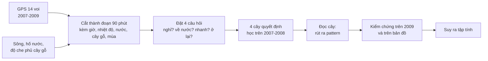

# Voi Kruger: dùng Decision Tree để tìm tập tính di chuyển của voi từ dữ liệu GPS

Dự án môn học Khai phá dữ liệu. Chúng tôi lấy dữ liệu GPS của 14 con voi cái ở Vườn quốc gia Kruger (Nam Phi), nhờ **cây quyết định (Decision Tree)** tự tìm ra các quy luật di chuyển, kiểm tra chúng trên dữ liệu năm sau, rồi từ các quy luật đó **suy ra tập tính của voi** và trình diễn trên bản đồ web.

Dự án dựa trên bài báo: Thaker M, Gupte PR, Prins HHT, Slotow R, Vanak AT (2019). *Fine-scale tracking of ambient temperature and movement reveals shuttling behavior of elephants to water.* Front. Ecol. Evol. 7:4 (file `fevo-07-00004.pdf`).

**README này viết cho cả nhóm, không cần biết lập trình.** Nó đi theo đúng trình tự của dự án: dữ liệu gốc → xử lý → đặt câu hỏi → tạo cây → kiểm chứng → đọc pattern → suy ra tập tính → ý nghĩa của kết quả → demo.

## Tóm tắt

- **Dữ liệu:** 283.688 điểm GPS của 14 voi trong 2 năm (08/2007–08/2009), cộng thêm vị trí sông và hố nước, độ che phủ cây gỗ, nhiệt độ vòng cổ, mùa.
- **Cách làm:** chia hành trình thành đoạn 90 phút, đặt **bốn câu hỏi** về hành vi (nghỉ? về nước? đi nhanh? ở lại?), mỗi câu một cây quyết định học trên 2007–2008.
- **Kiểm chứng:** đối chiếu trên năm 2009 và so với một "đối thủ ngây thơ". Cả bốn cây đều thắng đối thủ, nhưng điểm chỉ ở mức trung bình (macro-F1 0,57 đến 0,70).
- **Phát hiện chính:**
  - Voi **nghỉ tập trung vào khoảng 01:30–04:30 đêm**, khả năng ít di chuyển gấp khoảng 4 lần bình thường.
  - Voi sống theo **chu kỳ khoảng một ngày quanh nguồn nước**: chiều tối rời nước, ban đêm ở xa, sáng quay lại (nhiều nhất 09:00–12:00).
  - Ban ngày voi **đi chậm hơn ở nơi cây gỗ dày**, và nhanh hơn vào mùa mưa.
- **Lưu ý:** cây chỉ thấy các con số hình học. "Voi ngủ", "voi đi uống nước" là **diễn giải của con người**, không phải thứ GPS đo được.

**Xem demo ngay:** mở `elephant_dt/web/index.html` bằng Chrome hoặc Edge (cần Internet để hiện ảnh vệ tinh nền). Không cần cài gì và không cần chạy Python.

## Mục lục

1. [Dự án trả lời câu hỏi gì](#1-dự-án-trả-lời-câu-hỏi-gì)
2. [Dữ liệu gốc có gì](#2-dữ-liệu-gốc-có-gì)
3. [Xử lý dữ liệu](#3-xử-lý-dữ-liệu)
4. [Đặt câu hỏi và nhãn: bốn cây](#4-đặt-câu-hỏi-và-nhãn-bốn-cây)
5. [Cây được tạo ra như thế nào](#5-cây-được-tạo-ra-như-thế-nào)
6. [Kiểm chứng](#6-kiểm-chứng)
7. [Từ cây rút ra pattern](#7-từ-cây-rút-ra-pattern)
8. [Từ pattern phân tích tập tính](#8-từ-pattern-phân-tích-tập-tính)
9. [Kết quả phản ánh điều gì](#9-kết-quả-phản-ánh-điều-gì)
10. [Demo đang diễn giải gì và cách dùng](#10-demo-đang-diễn-giải-gì-và-cách-dùng)
11. [Giới hạn](#11-giới-hạn)
12. [Chạy lại và cấu trúc thư mục](#12-chạy-lại-và-cấu-trúc-thư-mục)
13. [Nguồn](#13-nguồn)

---

## 1. Dự án trả lời câu hỏi gì

> Chỉ từ tọa độ GPS (khoảng 30 phút một điểm) và vài thông tin về môi trường, có tìm ra được voi sống theo nhịp nào không, và nhịp đó có còn đúng ở năm sau không?

Ý tưởng cốt lõi: **không tự đoán** tập tính của voi, mà để một thuật toán đơn giản, đọc được là cây quyết định, tự tìm xem yếu tố nào (giờ, khoảng cách tới nước, cây gỗ, mùa…) liên quan tới hành vi. Chúng tôi đọc các quy luật cây tìm ra, kiểm lại, rồi mới đặt tên cho hành vi.



---

## 2. Dữ liệu gốc có gì

### 2.1 GPS voi (dữ liệu chính)

File `ThermochronTracking Elephants Kruger 2007.csv` từ Movebank. Mỗi dòng là một lần định vị. Chúng tôi dùng 4 cột:

| Cột | Ý nghĩa |
| --- | --- |
| mã voi | AM91, AM93, AM99, AM105, AM107, AM108, AM110, AM239, AM253, AM254, AM255, AM306, AM307, AM308 |
| thời gian | Giờ UTC của lần định vị |
| kinh độ, vĩ độ | Vị trí voi |
| nhiệt độ vòng cổ | Cảm biến gắn trên vòng cổ GPS (°C) |

Quy mô: **283.688 điểm**, 14 voi cái (mỗi voi thuộc một đàn khác nhau), từ 13/08/2007 đến 12/08/2009, khoảng **30 phút một điểm**. Mỗi voi được theo dõi trung bình khoảng 1,5 năm.

### 2.2 Dữ liệu môi trường

| Dữ liệu | Là gì | Nguồn |
| --- | --- | --- |
| **Hố nước** | 124 hố nước đang mở trong vùng nghiên cứu | Kho dữ liệu của tác giả paper (`elemove`) |
| **Sông, suối** | 939 đoạn sông suối, trong đó khoảng 468 đoạn có nước quanh năm, còn lại chỉ có nước theo mùa | Kho dữ liệu của tác giả paper (`elemove`) |
| **Độ che phủ cây gỗ** | Phần trăm diện tích có cây gỗ, độ phân giải khoảng 100 m, từ 0 đến 80% (trung vị khoảng 35%) | Kho code của tác giả. Đây là bề mặt do tác giả nội suy, **không phải** bản đồ gốc |
| **Mặt nước OpenStreetMap** | Hình dạng hồ, sông | OpenStreetMap. **Chỉ để vẽ nền bản đồ**, không dùng để tính |
| **Mùa** | Mùa mưa là 13/10 đến 21/04, còn lại là mùa khô | Quy ước theo lịch. Chúng tôi **không có** số liệu lượng mưa thật |

---

## 3. Xử lý dữ liệu

Cách xử lý chia thành 6 bước. Tên file thực hiện ở mục 12.

### 3.1 Làm sạch GPS
- Bỏ dòng thiếu dữ liệu và dòng trùng (cùng voi, cùng thời điểm).
- Đổi giờ UTC sang **giờ địa phương Nam Phi (UTC+2)**. Mọi giờ trong tài liệu này là giờ địa phương.
- Đổi tọa độ sang **mét** (hệ UTM 36S) để tính khoảng cách chính xác.
- Tính quãng đường giữa hai điểm liên tiếp. Bước nào đòi hỏi tốc độ trên 10 km/h thì coi là lỗi GPS và đánh dấu (chỉ có 4 bước như vậy).

### 3.2 Khoảng cách tới nguồn nước
- Với mỗi điểm GPS, tìm nguồn nước gần nhất và tính khoảng cách thẳng. **Mùa khô** chỉ tính sông có nước quanh năm và hố nước; **mùa mưa** tính thêm sông theo mùa (đúng quy tắc của paper).
- **"Ở vùng nước"** nghĩa là cách nguồn nước không quá **200 m** (đúng ngưỡng của paper). Khoảng 22% điểm GPS nằm trong vùng này.
- Khoảng cách trung bình tới nước: 1,41 km (mùa khô), 0,95 km (mùa mưa).

### 3.3 Độ che phủ cây gỗ
- Lấy giá trị cây gỗ tại điểm GPS, và trung bình trong ô khoảng 300 m quanh điểm.
- Khoảng 6% điểm GPS không có giá trị cây gỗ. Những điểm này được giữ là thiếu (không điền 0), có cờ riêng "thiếu cây gỗ" cho cây biết.

### 3.4 Mùa
Gán mùa mưa hoặc mùa khô theo ngày dương lịch. Mùa mưa có 145.004 điểm, mùa khô có 138.684 điểm (gần bằng nhau, giống paper).

### 3.5 Các "chuyến giữa hai lần ghé nước"
Một **chuyến** là quãng đường voi đi từ lúc rời vùng nước (200 m) tới lúc quay lại vùng nước (khái niệm của paper). Chúng tôi tìm được **2.913 chuyến** (paper: 2.835), và dùng chúng để tính:
- **Thời gian đã rời nước**: voi đã ở ngoài vùng nước bao nhiêu giờ (đặc trưng cho cây).
- Số liệu mô tả: chuyến kéo dài bao lâu, đi bao xa, rời nước và về nước lúc mấy giờ.

### 3.6 Cắt thành cửa sổ 90 phút
Đây là bước tạo ra **bảng dữ liệu để cây học**.

- Mỗi voi được đặt lên các mốc cách nhau 90 phút theo giờ địa phương (00:00, 01:30, 03:00, …, 22:30).
- Mỗi mốc trở thành **một hàng dữ liệu (một mẫu)**: một voi, tại một thời điểm.
- Từ mỗi mốc, nhìn về **phía trước 90 phút** (hoặc 3 giờ ở cây 2) để biết voi sẽ làm gì. Đó là **nhãn (đáp án)** cây cần học.
- Loại các cửa sổ có GPS mất tín hiệu quá lâu hoặc có bước nhảy bất thường, vì sẽ đo sai quãng đường.

Kết quả: **80.487 cửa sổ**, trong đó **75.738** đủ chất lượng.

**Quy tắc quan trọng nhất: không nhìn vào tương lai.**
- **Đặc trưng (đầu vào)** chỉ lấy từ GPS **tại hoặc trước** mốc dự báo (điểm GPS cũ không quá 30 phút).
- **Nhãn (đáp án)** mới lấy từ GPS **sau** mốc đó.
- Cây **không được biết** voi vừa đi bao xa hoặc theo hướng nào. Nếu biết, cây sẽ chỉ học "đang đi thì tiếp tục đi", một kết quả vô nghĩa về hành vi.

Một mẫu trông như thế nào (ví dụ thật):

| Phần | Nội dung |
| --- | --- |
| Đặc trưng (đầu vào) | AM108, 01:30, mùa mưa, nhiệt độ 24°C (giảm 2°C so với 90 phút trước), cách nước 0,86 km, cây gỗ 34% |
| Nhãn (đáp án) | Đường đi 90 phút tới là **29 m**, nên nhãn là **Nghỉ** |

---

## 4. Đặt câu hỏi và nhãn: bốn cây

Một cây chỉ trả lời một câu hỏi hai đáp án. Chúng tôi dùng **bốn cây độc lập**, mỗi cây một khía cạnh hành vi. Mỗi cây lấy **một tập con** các cửa sổ phù hợp với câu hỏi của nó.

| Cây | Câu hỏi | Mẫu nào được dùng | Nhãn được định nghĩa thế nào |
| --- | --- | --- | --- |
| **1. Nghỉ** | Trong 90 phút tới voi nghỉ hay di chuyển? | Mọi cửa sổ | Nghỉ = đi **dưới 75 m** trong 90 phút |
| **2. Về nước** | Voi đang ở xa nước có quay lại vùng nước trong 3 giờ tới không? | Voi đang cách nước **trên 200 m** | Về nước = trong 3 giờ tới có điểm GPS nằm trong vùng 200 m quanh nước |
| **3. Tốc độ** | Ban ngày, khi voi đi, đi nhanh hay chậm? | Ban ngày 06:00–18:00 và voi **đang đi** (từ 75 m) | Nhanh = đi **trên 653 m** trong 90 phút |
| **4. Ở nước** | Voi đang ở trong vùng nước sẽ ở lại hay rời đi? | Voi **đang trong vùng 200 m** quanh nước | Ở lại = đi **dưới 150 m** trong 90 phút |

**Các mốc được chọn thế nào:**
- **75 m (cây 1):** chọn dựa trên khảo sát quỹ đạo. Dưới mức này, quãng đường đo được gần như chỉ là nhiễu GPS (voi đứng yên vẫn "đi" vài chục mét do sai số). Báo cáo: `elephant_dt/outputs/movement_eda.md`.
- **653 m (cây 3):** trung vị quãng đường của tập học, nên tập học chia đôi 50/50 nhanh và chậm.
- **150 m (cây 4):** ngưỡng riêng cho voi đang ở vùng nước.
- **200 m (vùng nước):** đúng ngưỡng của paper.

**Số mẫu (học 08/2007–12/2008 / năm 2009) và tỉ lệ nhãn:**

| Cây | Số mẫu học | Số mẫu 2009 | Nhãn hiếm hay đáng chú ý |
| --- | ---: | ---: | --- |
| 1. Nghỉ | 59.207 | 16.517 | Nghỉ chỉ chiếm khoảng 7% (lớp rất hiếm) |
| 2. Về nước | 44.307 | 12.299 | Về nước khoảng 22% |
| 3. Tốc độ | 29.212 | 8.107 | Nhanh khoảng 50% (fit), 35% (validation), 49% (2009) |
| 4. Ở nước | 12.928 | 3.327 | Ở lại khoảng 12–21%. **Ít mẫu nhất** |

**Các đặc trưng đưa vào cây** (10 đặc trưng, thêm "thời gian đã rời nước" cho cây 2 và 3, là 11):

| Đặc trưng | Ý nghĩa |
| --- | --- |
| giờ | Giờ địa phương của mốc dự báo |
| nhiệt độ | Nhiệt độ vòng cổ (°C) |
| mức đổi nhiệt độ | Nhiệt độ hiện tại trừ nhiệt độ 90 phút và 3 giờ trước (cho biết trời đang ấm lên hay lạnh đi) |
| mùa | Mùa mưa hay mùa khô |
| khoảng cách tới nước | Tới nguồn nước gần nhất (km) |
| cây gỗ | Độ che phủ cây gỗ tại điểm GPS và trung bình quanh ~300 m, cờ "thiếu dữ liệu" |
| tuổi điểm GPS | Điểm GPS neo cũ bao nhiêu phút (kiểm soát chất lượng) |
| thời gian đã rời nước | Chỉ cây 2 và 3 dùng. Cây 4 không dùng vì khi voi đang ở vùng nước, giá trị này gần như luôn thiếu |

Giá trị thiếu được thay bằng **trung vị của tập học** (không lấy từ 2009).

Cây được **đưa cho nhiều đặc trưng nhưng chỉ dùng vài cái trong luật**. Ví dụ cây 1 thực tế chỉ dựa vào giờ, mùa và mức đổi nhiệt độ; cây gỗ chỉ xuất hiện trong luật của cây 3 và cây 4. Phần "cây dùng cái gì" trong `elephant_dt/KICH_BAN_SLIDE.md`, mục 1.5.7.

---

## 5. Cây được tạo ra như thế nào

### 5.1 Cây quyết định là gì

Cây quyết định là một chuỗi câu hỏi có/không. Mỗi câu hỏi chia dữ liệu làm hai nhánh. Đi từ gốc xuống, trả lời hết các câu hỏi thì tới một **lá** cho ra đáp án. Ví dụ rút gọn của cây "Nghỉ hay di chuyển?":

```
Giờ ≤ 03:45 ?
├── có → Giờ > 00:45 ?
│        ├── có    → NGHỈ                  ← pattern chính (gấp ~4 lần bình thường)
│        └── không → NGHỈ (nhẹ hơn, gấp ~2 lần)
└── không → xét tiếp (phần lớn là DI CHUYỂN)
```

**Một đường từ gốc tới lá chính là một luật**: "nếu mọi điều kiện trên đường đi cùng đúng thì dự đoán nhãn ở lá".

### 5.2 Cách máy học cây

- Dùng thuật toán cây quyết định của thư viện scikit-learn.
- **Cân bằng lớp hiếm:** nhãn "nghỉ" chỉ 7%, nếu để nguyên cây sẽ luôn đoán "di chuyển" cho đạt điểm cao. Chúng tôi bắt cây coi hai lớp quan trọng như nhau (`class_weight="balanced"`).
- **Không để cây quá to:** thử nhiều độ sâu và cỡ lá tối thiểu, đo điểm trên tập validation (2008). Trong các cấu hình điểm gần bằng nhau (chênh dưới 0,01), chọn cây **ít lá nhất**, vì mục đích là cây đọc được.
- Cây cuối cùng được học lại trên toàn bộ dữ liệu 2007–2008.

**Cây thu được:**

| Cây | Độ sâu | Số lá (số luật) |
| --- | ---: | ---: |
| 1. Nghỉ | 3 | 6 |
| 2. Về nước | 4 | 14 |
| 3. Tốc độ | 5 | 17 |
| 4. Ở nước | 3 | 8 |

### 5.3 Từ cây ra bảng luật

Mỗi lá được xuất ra một luật, kèm các con số kiểm tra:

| Chỉ số | Ý nghĩa |
| --- | --- |
| **Số mẫu** | Luật này áp dụng cho bao nhiêu cửa sổ, của bao nhiêu voi |
| **Lift** | Tỉ lệ nhãn trong luật chia cho tỉ lệ chung. Lift 4 là nhãn đó xảy ra gấp 4 lần bình thường; lift gần 1 là luật không có ý nghĩa. Tính riêng cho 2007–2008, validation và 2009 |
| **Số voi cùng xu hướng** | Có bao nhiêu voi (đủ mẫu) cho thấy lift lớn hơn 1 |
| **Ổn định** | Luật "đáng tin" nếu lift trên 1,1 ở cả validation và 2009, **và** lift trên 1 ở ít nhất 2/3 số voi |

Toàn bộ luật của bốn cây nằm trong `elephant_dt/outputs/tasks_report.md`.

---

## 6. Kiểm chứng

### 6.1 Chia dữ liệu theo thời gian

| Giai đoạn | Dùng để làm gì |
| --- | --- |
| 08/2007 – 06/2008 (**fit**) | Cây học từ đây |
| 07/2008 – 12/2008 (**validation**) | Chọn độ phức tạp của cây |
| **Năm 2009** | Đối chiếu: pattern tìm ở 2007–2008 còn đúng không |

Chia **theo thời gian** (không xáo trộn ngẫu nhiên), vì mục tiêu là hỏi "quy luật này có giữ được sang năm sau không". Cửa sổ nào có phần "tương lai" chạm sang giai đoạn sau thì bị bỏ khỏi giai đoạn trước, để nhãn không lọt qua ranh giới. Ở 2009 chỉ giữ voi có ít nhất 16 cửa sổ (còn **11 voi**).

**Nói thẳng:** năm 2009 đã được xem ở các phiên bản trước của dự án, nên đây là **phép đối chiếu**, không phải bài kiểm tra mù hoàn toàn. Cấu hình cuối chỉ chọn dựa vào validation.

### 6.2 So với "đối thủ ngây thơ"

Đối thủ là mô hình **luôn đoán lớp đông nhất** (ví dụ luôn đoán "di chuyển"). Mô hình này có độ chính xác (accuracy) rất cao (93% ở cây 1) nhưng vô dụng. Vì vậy chúng tôi chấm bằng **macro-F1** (từ 0 đến 1, tính cả hai lớp như nhau, kể cả lớp hiếm).

| Cây | Cây quyết định (validation / 2009) | Đối thủ ngây thơ (validation / 2009) |
| --- | --- | --- |
| 1. Nghỉ | 0,61 / 0,60 | 0,48 / 0,48 |
| 2. Về nước | 0,70 / 0,69 | 0,44 / 0,43 |
| 3. Tốc độ | 0,57 / 0,62 | 0,39 / 0,34 |
| 4. Ở nước | 0,63 / 0,60 | 0,44 / 0,46 |

**Đọc kết quả:** cây thắng đối thủ ở cả bốn câu hỏi và điểm gần như giữ nguyên từ validation sang 2009 (tức không học vẹt). Nhưng điểm chỉ ở mức trung bình, vì hành vi động vật có nhiều lý do mà GPS không thấy. Mục tiêu của dự án là **hiểu**, không phải đạt điểm cao nhất.

### 6.3 Thử bỏ từng nhóm đặc trưng

Bỏ lần lượt từng nhóm đặc trưng rồi xem điểm giảm bao nhiêu, để biết cây thực sự dựa vào đâu:
- **Cây 1:** bỏ giờ thì điểm rơi từ 0,61 xuống 0,49; bỏ nhóm khác gần như không đổi. Nghỉ là chuyện của đồng hồ.
- **Cây 2:** bỏ khoảng cách tới nước thì điểm rơi từ 0,70 xuống 0,57. Đây là yếu tố mạnh nhất (nhưng hiển nhiên).
- **Cây 3:** bỏ từng nhóm đều không đổi nhiều; cây dựa vào nhiều tín hiệu yếu cộng lại.
- **Cây 4:** bỏ giờ thì điểm rơi từ 0,63 xuống 0,54.

### 6.4 Pattern phải qua ba lần kiểm

Một pattern chỉ được coi là đáng tin khi:
1. đúng ở **validation (2008) và năm 2009**,
2. đúng với **đa số voi** (không chỉ vài con),
3. được **số liệu mô tả** đếm lại độc lập với cây xác nhận.

---

## 7. Từ cây rút ra pattern

**Pattern** là một luật của cây vừa mạnh, vừa ổn định. Cách chọn:
1. Liệt kê các luật (lá) và lift của từng luật.
2. Giữ luật "đáng tin" (đạt cả ba lần kiểm ở mục 6.4).
3. Chọn luật nổi bật nhất. Với cây 2, 3, 4 là luật đáng tin xếp cao nhất theo lift ở 2009 và số mẫu. Với cây 1 là luật có lift cao nhất (00:45–03:45).
4. Dùng số liệu mô tả (đếm theo giờ, mùa, cây gỗ, từng voi…) để kiểm lại.

**Bốn pattern rõ nhất (cây tìm ra):**

| Cây | Luật (pattern) | Số mẫu | Lift (học / validation / 2009) | Voi cùng xu hướng (2007–08 · 2009) |
| --- | --- | ---: | --- | --- |
| **1. Nghỉ** | 00:45 < giờ ≤ 03:45 → **nghỉ** | 6.817 | 4,74 / 3,63 / 4,62 | 14/14 · 10/10 |
| **2. Về nước** | cách nước ≤ 540 m, 03:45 < giờ ≤ 17:15 → **về nước** | 5.500 | 2,99 / 2,96 / 2,62 | 14/14 · 11/11 |
| **3. Tốc độ** | mùa khô, trước 14:15, cây gỗ ≤ 45%, đã rời nước 5,5–15 giờ → **đi chậm** | 4.322 | 1,32 / 1,18 / 1,31 | 14/14 · 9/9 |
| **4. Ở nước** | 00:45 < giờ ≤ 03:45, cây gỗ > 37% → **ở lại** | 398 | 5,21 / 2,93 / 4,03 | 5/5 · (quá ít mẫu) |

**Mạnh nhất là cây 1 và cây 2.** Pattern cây 3 là tín hiệu yếu (lift 1,3) nhưng đúng ở mọi voi; luật mạnh nhất của cây 3 liên quan cây gỗ: "mùa khô, trước 14:15, cây gỗ > 45% → đi chậm" (lift 1,4–1,6). Pattern cây 4 dựa trên rất ít mẫu, bằng chứng yếu nhất.

---

## 8. Từ pattern phân tích tập tính

Mỗi tập tính được suy ra theo **ba bước**, mỗi bước có tên để không lẫn:

| Bước | Ví dụ với cây 1 | Ai làm |
| --- | --- | --- |
| **Cây tìm ra** | "Từ 00:45 đến 03:45, khả năng voi ít di chuyển gấp khoảng 4 lần bình thường" | Cây quyết định |
| **Số liệu mô tả** | "67% các lần nghỉ nằm ở 00:00–04:30; nghỉ gần như không đổi dù voi ở gần hay xa nước" | Chúng tôi đếm thêm trên cùng dữ liệu |
| **Diễn giải** | "Voi đang ngủ hoặc nghỉ ngơi" | Con người, ghi rõ là giả thuyết |

### 8.1 Cây 1: nhịp nghỉ ban đêm

- Tỉ lệ nghỉ theo giờ bắt đầu cửa sổ: 00:00 là 16%, **01:30 là 30%, 03:00 là 38%**, rồi **rơi đột ngột còn 7% ở 04:30**; ban ngày chỉ 1–4%. Kết quả giống nhau ở 2007–2008 và 2009.
- Nghỉ ngắn và vụn: 80% đợt nghỉ chỉ kéo dài một cửa sổ (khoảng 1,5 giờ). Tổng thời gian GPS gần như đứng yên khoảng 1,5–2 giờ mỗi ngày.
- Nghỉ **không phụ thuộc** voi ở gần hay xa nước, cũng không khác theo mùa. Có xu hướng nghỉ nhiều hơn ở chỗ cây gỗ dày (phân tích mô tả, cây không dùng).
- Chỉ khoảng 2/3 số đêm có lần nghỉ nào; **một phần ba số đêm không có lần nghỉ nào**.
- **Tập tính suy ra:** voi có một "cửa sổ nghỉ" ban đêm khá hẹp (khoảng 01:30–04:30), kết thúc đột ngột trước khi trời sáng; ban ngày gần như luôn di chuyển.

### 8.2 Cây 2: nhịp đi và về nước

- Cố định khoảng cách 0,3–1,5 km: xác suất về nước trong 3 giờ là **6–12% giữa đêm**, leo từ 04:30, **đỉnh 48–55% lúc 09:00–10:30**, rồi giảm về tối (khoảng 14% lúc 22:30).
- 2.913 chuyến: **57% chuyến rời nước vào 15:00–21:00**, **65% chuyến về nước vào 06:00–15:00**. Chuyến điển hình kéo dài 19–22 giờ, đi 7–8 km nhưng chỉ cách nước tối đa khoảng 2 km.
- Trời ấm lên thì về nước nhiều hơn một chút (và bão hòa trên 30°C).
- **Tập tính suy ra:** voi sống theo chu kỳ khoảng một ngày quanh nguồn nước: chiều tối rời nước, ban đêm ở xa, sáng quay lại, nhiều nhất vào buổi sáng. Voi hiếm khi đi xa hơn khoảng 2 km quanh nước. Đây là hiện tượng "shuttling" mà paper mô tả.

### 8.3 Cây 3: cách voi đi ban ngày

- Ban ngày voi hầu như luôn đi (97,6% cửa sổ), chậm, khoảng 0,4 km/giờ.
- Cây gỗ ~300 m quanh voi dày hơn thì tỉ lệ đi nhanh giảm đều (53% ở 0–25%, còn 34% ở trên 45%), **đúng ở cả hai mùa và cả hai giai đoạn**.
- Mùa mưa đi nhanh hơn mùa khô (53–61% so với 36%). Chiều muộn (16:30) tăng tốc, trùng lúc voi rời nước.
- **Tập tính suy ra:** voi đi chậm lại ở nơi cây gỗ dày (có thể là vừa đi vừa ăn hoặc tìm bóng), nhanh hơn ở nơi thưa.

### 8.4 Cây 4: voi làm gì khi đang ở vùng nước

- Khi voi đang ở vùng nước, tỉ lệ ở lại tại chỗ đạt **khoảng 59% lúc 03:00** (ở cả hai giai đoạn), so với 4–16% ban ngày.
- Ban ngày nhiều voi ghé vùng nước hơn (đỉnh 13:30–15:00, khoảng 35% cửa sổ), nhưng chủ yếu **ghé qua rồi đi**. Ban đêm ít voi ở vùng nước (khoảng 12%), nhưng số ít đó ở lại.
- **Tập tính suy ra:** đây gần như là **cùng nhịp nghỉ đêm của cây 1**, xảy ra ở chỗ voi tình cờ đang đứng gần nước. Không phải voi đi tới nước để ngủ (cây 1 cho thấy phần lớn nghỉ xảy ra xa nước).

### 8.5 Ghép bốn cây thành một ngày của voi

| Khoảng giờ | Chuyện gì đang xảy ra |
| --- | --- |
| 22:30–01:30 | Voi đang xa nước, giảm dần di chuyển |
| **01:30–04:30** | **Cửa sổ nghỉ đêm.** Hầu như không đi tới nước. Voi đã ở vùng nước thì ở lại |
| 04:30–06:00 | Nghỉ kết thúc đột ngột; bắt đầu quay lại nước |
| 06:00–12:00 | Di chuyển liên tục và chậm; **đỉnh về nước 09:00–10:30** |
| 12:00–16:30 | Nhiều voi nhất ở vùng nước (13:30–15:00) nhưng chỉ ghé qua; chiều muộn đi nhanh dần và bắt đầu rời nước |
| 16:30–21:00 | **Rời nước** (57% chuyến rời vào 15:00–21:00); nhịp nghỉ bắt đầu tăng lại |

Câu chuyện này được **ghép** từ bốn cây và số liệu mô tả; từng mảnh có số liệu, cách ghép thành "một ngày" là diễn giải.

### 8.6 Những điều không được nói

- **Không nói "voi ngủ".** GPS chỉ cho biết voi ít di chuyển. Nói đúng: "voi ít di chuyển, có thể là ngủ hoặc nghỉ ngơi".
- **Không nói "voi uống nước".** Cây chỉ biết voi vào vùng 200 m quanh nguồn nước; có thể là tắm, bôi bùn, hay đi dọc bờ sông.
- **Không nói "A là nguyên nhân của B"** (cây gỗ làm voi chậm, trời nóng làm voi đi uống nước). Dữ liệu chỉ cho thấy hai thứ đi cùng nhau.
- **Không nói "đêm nào voi cũng nghỉ".** Pattern là xu hướng, không phải luật tuyệt đối.
- **Không nói "mùa khô voi khát hơn"** vì dữ liệu cho kết quả ngược lại (cùng khoảng cách tới nước, mùa mưa voi về nước nhiều hơn) và chúng tôi chưa giải thích được.

Chi tiết từng cây (bảng theo giờ, theo mùa, theo cây gỗ, từng voi, mức bằng chứng của 17 pattern) nằm trong **`elephant_dt/PHAN_TICH_TAP_TINH.md`**.

---

## 9. Kết quả phản ánh điều gì

**1. Voi có nhịp rõ theo đồng hồ.** Giờ trong ngày là yếu tố quan trọng nhất của cây nghỉ (bỏ giờ thì điểm rơi mạnh nhất) và của cây ở-nước. Nhịp này hiện lên rõ hơn nhiều so với tác động của mùa hay nhiệt độ.

**2. Nước là trung tâm của nhịp sống.** Khoảng cách tới nước quyết định cây về-nước; voi đi vòng quanh nguồn nước trong bán kính khoảng 2 km theo chu kỳ khoảng một ngày.

**3. Môi trường (cây gỗ, mùa, nhiệt độ) chỉ tác động nhỏ lên cách di chuyển.** Cây gỗ dày làm voi đi chậm hơn là tín hiệu rõ nhất; mùa và nhiệt độ có tác động nhưng nhỏ và đi cùng giờ trong ngày.

**4. Đối chiếu với paper gốc:**

| Điều | Paper | Dự án này |
| --- | --- | --- |
| Chu kỳ đi–về nước | Có nhịp tuần hoàn, đỉnh quay lại 10–30 giờ | Chuyến trung vị 19–22 giờ |
| Giờ rời / về nước | Rời khoảng 13:00–14:00, về khoảng 10:00–11:00 | Rời nhiều nhất 15:00–21:00, về nhiều nhất 06:00–15:00 (đỉnh 09:00–12:00) |
| Gần nước nhất lúc nóng nhất | Có | Có mặt ở vùng nước đỉnh lúc 13:30–15:00 |
| Chậm hơn ở nơi cây gỗ dày | Có | Có (cây 3) |
| Nhanh hơn vào mùa mưa | Có (0,42 so với 0,39 km/giờ) | Có (53–61% so với 36%) |
| Tốc độ trung bình | Khoảng 0,4 km/giờ | 0,39–0,44 km/giờ |
| Thời gian ở vùng 200 m quanh nước | 21,6% | Khoảng 22% |

Phần **nghỉ ban đêm (cây 1)** là phần dự án tự thêm vào; paper không phân tích. Hai điểm khác paper: paper báo cáo voi ở nước lâu hơn vào mùa khô, nhưng cây 4 không cho thấy pattern theo mùa ổn định; và chúng tôi dùng cửa sổ 90 phút nên các hiệu ứng nhỏ bị làm mờ so với mô hình của paper.

**5. Mức tin cậy.** Mạnh nhất: nghỉ ban đêm; voi hầu như luôn đi ban ngày; về nước ban ngày/sáng và gần như không về ban đêm; chu kỳ khoảng một ngày quanh nước; cây gỗ dày làm voi đi chậm. Yếu hoặc không có: các pattern theo mùa (cây 2, cây 4), pattern cây gỗ của cây 4, và nhịp "nhanh–chậm–nhanh" theo thời gian rời nước ở mùa khô.

**6. Điều quan trọng nhất về cách làm.** Một cây quyết định đơn giản, đọc được, chỉ từ GPS đã tự tìm lại được các nhịp mà paper và hiểu biết về voi đã nêu, và các nhịp đó giữ nguyên ở năm sau. Nó cũng cho thấy giới hạn của GPS: nhãn nào cũng chỉ là "ít di chuyển", "vào vùng nước", chứ không phải hành vi thật.

---

## 10. Demo đang diễn giải gì và cách dùng

Demo là trang web chạy trên máy (không cần server): `elephant_dt/web/index.html`. Nó **phát lại năm 2009** trên bản đồ vệ tinh vùng nghiên cứu, kèm dự đoán của cây, để bạn thấy pattern có đúng với từng con voi hay không.

### 10.1 Trên bản đồ có gì

- **Biểu tượng voi** là vị trí thật của voi theo thời gian, mỗi con có tên (ví dụ AM108).
- **Huy hiệu tròn cạnh voi** là **dự đoán của cây** đang chọn cho 90 phút (hoặc 3 giờ) sắp tới. Màu và hình đổi theo cây.
- **Vệt trắng** là đường đi thật 3 ngày qua. Đoạn mờ nghĩa là mất tín hiệu GPS, chỉ nối thẳng cho dễ nhìn.
- **Vòng tròn xanh** là hố nước (phóng to sẽ thấy tên), đường xanh là sông, vùng xanh là hồ.
- **Thanh thời gian** phía dưới: ▶ chạy hoặc dừng, kéo thanh trượt để nhảy tới ngày bất kỳ của 2009. Dải màu mỏng phía trên là mùa mưa (xanh) và mùa khô.

### 10.2 Demo cho biết điều gì

Ý đồ của demo là so **dự đoán** với **thực tế**, và cho thấy **luật nào dẫn tới dự đoán**:
- Bấm vào một con voi, thẻ hiện: dự đoán của cây, **thực tế** trong khoảng thời gian đó (trùng hay khác), các điều kiện lúc đó (giờ, nhiệt độ, cách nước, cây gỗ), và mục **"Vì (luật của cây)"**.
- Nhìn nhiều con voi và nhiều ngày giúp thấy pattern **không phải lúc nào cũng đúng**, mà là xu hướng.

### 10.3 Các nút

**Bốn nút góc trên trái:** **Nghỉ · Về nước · Tốc độ · Ở nước** chọn cây (phím `1` đến `4`, hoặc `[` và `]`).

**Các nút góc trên phải:**

| Nút | Dùng để |
| --- | --- |
| **Voi** | Chọn voi nào hiện trên bản đồ |
| **Pattern** | Số liệu chứng minh pattern của cây đang chọn: biểu đồ theo giờ, mùa, cây gỗ, nhiệt độ |
| **Luật** | Danh sách luật của cây. Bấm một luật thì bản đồ hiện mọi chỗ luật đó xảy ra năm 2009; "Xem ví dụ" nhảy tới một lần cụ thể |
| **Cây** | Sơ đồ cây quyết định. **Nhánh vàng** là đường từ gốc tới lá cho ra pattern, lá có nhãn "Pattern"; ô **Pattern** ở góc ghi pattern bằng lời |
| **Kiểm tra** (phím `P`) | Chế độ kiểm tra pattern trên 2009, xem bên dưới |
| ⛶ (phím `F`) | Toàn màn hình |

Phím cách chạy/dừng; mũi tên trái/phải lùi/tiến 90 phút (giữ Shift là một ngày); `H` ẩn giao diện; `Esc` đóng bảng.

### 10.4 Chế độ Kiểm tra (phím P)

Dùng để **chứng minh pattern bằng một con voi cụ thể**. Màn hình chỉ còn bản đồ, thanh thời gian và một ô duy nhất:

1. **Pattern** của cây đang chọn, viết bằng lời.
2. **Độ đúng chung ở 2009**, ví dụ "31% là nghỉ (chung 7%) · 1.890 lần · 11 voi". Nghĩa là khi điều kiện của pattern xảy ra, voi thực sự ở trạng thái đó 31% số lần, so với 7% nếu chọn bừa một thời điểm.
3. **Danh sách voi:** ba con khớp pattern nhất và một con "ít rõ nhất". Con "ít rõ nhất" được thêm vào để không chỉ khoe các ca đẹp.
4. Bấm một con voi: bản đồ nhảy tới một lần pattern xảy ra, ô hiện **Dự đoán** và **Thực tế** (viền xanh nếu trùng, đỏ nếu khác). **Chạy 90 phút tới** phát đúng khoảng thời gian đó để thấy voi thật sự làm gì; **Ví dụ khác** sang ngày kế tiếp.

### 10.5 Gợi ý trình bày một cây

1. Chọn cây (phím `1`–`4`), bấm **Cây**: chỉ nhánh vàng và ô Pattern, đọc pattern bằng lời.
2. Đóng sơ đồ, bấm **Kiểm tra** (`P`): xem độ đúng chung, chọn một con voi, bấm **Chạy 90 phút tới**.
3. Bấm **Pattern** (phím `P` lần nữa để thoát chế độ kiểm tra) để cho xem biểu đồ chứng minh.
4. Nói pattern, rồi **diễn giải kèm cảnh báo** ("voi ít di chuyển, có thể là ngủ hoặc nghỉ ngơi").

Địa chỉ trang tự cập nhật theo cây, voi và thời điểm đang xem (`#task=water&ele=AM99&t=…`), gửi địa chỉ đó cho bạn cùng nhóm để mở đúng cảnh.

---

## 11. Giới hạn

- **GPS thô:** sai số cỡ chục mét, 30 phút mới có một điểm, cửa sổ 90 phút chỉ có khoảng 3–4 điểm. Mọi nhãn ("nghỉ", "ở lại") chỉ là ước lượng.
- **Mẫu nhỏ:** 14 voi cái, mỗi voi một đàn, trong 2 năm. Không có voi đực, không có thông tin về đàn, tuổi, thức ăn, thú săn mồi, con người, trăng.
- **Môi trường xấp xỉ:** mùa theo lịch quy ước; cây gỗ là bề mặt nội suy của tác giả; nhiệt độ là nhiệt độ **vòng cổ** (gồm nhiệt do thiết bị và cơ thể voi), không phải nhiệt độ môi trường thật.
- **Năm 2009 chỉ là phép đối chiếu**, không phải bài kiểm tra mù (mục 6.1).
- **Cây đơn giản**, đọc được nhưng không chính xác bằng mô hình phức tạp. Đây là chủ ý.
- **Cây 4 ít mẫu nhất**, bằng chứng yếu nhất. Ngưỡng "nhanh" của cây 3 cố định theo tập học nên tỉ lệ "nhanh" khác nhau giữa các năm.
- **Liên hệ không phải nhân quả.** Mọi diễn giải tập tính chỉ là giả thuyết có cơ sở.

---

## 12. Chạy lại và cấu trúc thư mục

### 12.1 Chạy lại toàn bộ quy trình (không bắt buộc)

Cần Python 3.12 (đã thử với 3.12.7). Từ thư mục gốc của repo:

```powershell
python -m venv .venv
.venv\Scripts\python -m pip install -r elephant_dt\requirements.txt
.venv\Scripts\python elephant_dt\run_all.py
```

Chạy khoảng 1 phút. Xong mở `elephant_dt/web/index.html`.

Repo **không chứa** hai thứ dưới đây (dung lượng lớn hoặc là của người khác), nên ai muốn chạy lại phải tự lấy, đặt vào thư mục gốc của repo:
- **Dữ liệu GPS:** file `ThermochronTracking Elephants Kruger 2007.csv`, tải từ Movebank Data Repository (doi:10.5441/001/1.403h24q5), hoặc xin bạn trong nhóm.
- **Kho của tác giả paper** (ranh giới vùng nghiên cứu, hố nước, sông suối): chạy `git clone https://github.com/pratikunterwegs/elemove` ngay trong thư mục gốc, ra thư mục `elemove/`.

Bản đồ cây gỗ do `00_get_treecover.py` tự tải khi chạy (cần Internet). Mặt nước OSM đã có sẵn trong `elephant_dt/data/`. **Chỉ xem demo thì không cần các thứ trên**, vì dữ liệu cho web đã có sẵn trong `elephant_dt/web/data/`.

### 12.2 Các bước và file

| File (trong `elephant_dt/`) | Công việc | Mục trong README |
| --- | --- | --- |
| `config.py` | Hằng số chung: đường dẫn, vùng nước 200 m, mốc chia 2009, mốc mùa | |
| `00_get_treecover.py` | Tải và kiểm tra bản đồ cây gỗ từ kho của tác giả | 3.3 |
| `00_get_osm_water.py` | Tải mặt nước OSM làm nền bản đồ | 2.2 |
| `01_prepare.py` | Làm sạch GPS, tính khoảng cách tới nước, gắn cây gỗ và mùa | 3.1–3.4 |
| `02_segments_states.py` | Tìm các chuyến giữa hai lần ghé nước, tính thời gian đã rời nước | 3.5 |
| `movement.py` | Cắt cửa sổ 90 phút, nhãn "về nước" | 3.6 |
| `06_movement_eda.py` | Khảo sát dữ liệu để chọn ngưỡng 75 m. Báo cáo: `outputs/movement_eda.md` | 4 |
| `07_tasks_tree.py` | Huấn luyện bốn cây, kiểm chứng, xuất luật | 5, 6 |
| `04_export_tracks.py` | Xuất đường đi thật và lớp bản đồ cho web | 10 |
| `08_tasks_export.py` | Báo cáo `outputs/tasks_report.md` và dữ liệu dự đoán cho web | 10 |
| `09_behavior_stats.py` | Số liệu mô tả sâu cho từng cây, ghi `outputs/behavior_stats.md` | 8 |
| `vegetation.py` | Hàm lấy mẫu độ che phủ cây gỗ | 3.3 |
| `run_all.py` | Chạy lần lượt tất cả các bước trên | |
| `web/` | Trang demo: `index.html`, `tasks_app.js` (giao diện), `charts.js` (vẽ cây và biểu đồ), `style.css`, `data/` (dữ liệu đã xuất), `vendor/` (thư viện bản đồ) | 10 |

### 12.3 Tài liệu đi kèm (đọc thêm nếu cần)

| Tài liệu | Nội dung |
| --- | --- |
| `elephant_dt/PHAN_TICH_TAP_TINH.md` | Phân tích sâu từng cây: bảng số liệu, tập tính, điều không được nói, mức bằng chứng của 17 pattern |
| `elephant_dt/KICH_BAN_SLIDE.md` | Nội dung slide và kịch bản thuyết trình, thiết kế dữ liệu của từng cây chi tiết hơn |
| `elephant_dt/outputs/tasks_report.md` | Báo cáo kỹ thuật: độ chính xác và toàn bộ luật của bốn cây |
| `elephant_dt/outputs/movement_eda.md` | Khảo sát chọn ngưỡng nhãn |
| `elephant_dt/outputs/behavior_stats.md` | Toàn bộ bảng số liệu mô tả |

---

## 13. Nguồn

- Thaker M, Gupte PR, Prins HHT, Slotow R, Vanak AT (2019). Front. Ecol. Evol. 7:4. doi:10.3389/fevo.2019.00004
- Slotow R, Thaker M, Vanak AT (2019). Dữ liệu GPS, Movebank Data Repository. doi:10.5441/001/1.403h24q5
- Kho code của tác giả: github.com/pratikunterwegs/elephantTempKruger và github.com/pratikunterwegs/elemove (bản đồ cây gỗ nội suy, hố nước, sông suối, ranh giới vùng).
- OpenStreetMap contributors (mặt nước, sông suối làm nền bản đồ).
- Ảnh vệ tinh nền: Esri, Maxar, Earthstar Geographics.
- Thư viện web: MapLibre GL, deck.gl (đã đóng gói trong `elephant_dt/web/vendor/`).
