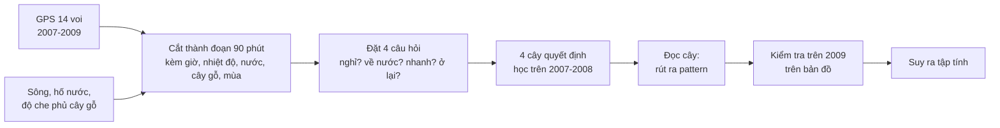

# Voi Kruger: dùng Decision Tree để tìm tập tính di chuyển của voi từ dữ liệu GPS

Dự án môn học Khai phá dữ liệu. Chúng tôi lấy dữ liệu GPS của 14 con voi cái ở Vườn quốc gia Kruger (Nam Phi), nhờ **cây quyết định (Decision Tree)** tự tìm ra các quy luật di chuyển, rồi **phát lại năm 2009 trên bản đồ** để kiểm tra những quy luật đó có còn đúng không. Từ các quy luật, chúng tôi suy ra tập tính của voi (ví dụ: khi nào voi nghỉ, khi nào đi uống nước).

Bài báo gốc: Thaker M, Gupte PR, Prins HHT, Slotow R, Vanak AT (2019). *Fine-scale tracking of ambient temperature and movement reveals shuttling behavior of elephants to water.* Frontiers in Ecology and Evolution 7:4 (file `fevo-07-00004.pdf`).

**Đọc README này không cần biết lập trình.** Muốn đi sâu hơn:

| Tài liệu | Nội dung |
| --- | --- |
| `KICH_BAN_SLIDE.md` | Dữ liệu là gì, xử lý thế nào, nội dung slide, kịch bản thuyết trình và demo |
| `PHAN_TICH_TAP_TINH.md` | Phân tích sâu từng cây: pattern, số liệu chứng minh, tập tính suy ra, điều không được nói |
| `outputs/tasks_report.md` | Báo cáo kỹ thuật: độ chính xác và toàn bộ luật của bốn cây |

---

## 1. Xem demo ngay

1. Mở file **`web/index.html`** bằng Chrome hoặc Edge (nhấp đúp là được, không cần cài gì).
2. Cần Internet để hiện ảnh vệ tinh nền (Esri). Mất mạng thì web vẫn chạy nhưng nền bản đồ đen.
3. Bấm nút ▶ ở thanh thời gian phía dưới để voi chạy trên bản đồ.

Mọi dữ liệu để chạy web đã có sẵn trong `web/data/`, nên **muốn xem demo thì không cần chạy Python**.

---

## 2. Dự án làm gì, trong một phút

**Câu hỏi:** chỉ từ tọa độ GPS (cứ 30 phút một điểm) và vài thông tin về môi trường, ta có tìm ra được voi sống theo nhịp nào không?

**Cách làm:**

1. Cắt hành trình của voi thành các **đoạn 90 phút**.
2. Với mỗi đoạn, đặt một **câu hỏi có hai đáp án** về hành vi (ví dụ: "trong 90 phút tới voi nghỉ hay di chuyển?"). Có bốn câu hỏi như vậy, mỗi câu một cây.
3. Cho **cây quyết định học** từ dữ liệu 2007–2008: giờ trong ngày, khoảng cách tới nước, nhiệt độ, cây gỗ, mùa… yếu tố nào giúp trả lời câu hỏi.
4. **Đọc cây** để rút ra pattern. Ví dụ cây nói "từ 00:45 đến 03:45 thì voi nghỉ".
5. **Kiểm tra trên năm 2009** (dữ liệu cây không dùng để học): pattern còn đúng không, đúng với bao nhiêu voi.
6. **Suy ra tập tính**: từ pattern, nhóm tự diễn giải ý nghĩa (ví dụ: nghỉ từ nửa đêm tới gần sáng có thể là voi đang ngủ hoặc nghỉ ngơi).

Điểm quan trọng: **cây không biết voi "ngủ" hay "uống nước".** Cây chỉ thấy các con số hình học (đi bao xa, cách nước bao xa, giờ nào). Việc gọi tên hành vi là phần suy luận của con người, và chúng tôi luôn ghi rõ đó là giả thuyết.



---

## 3. Dữ liệu

| Dữ liệu | Là gì | Nguồn |
| --- | --- | --- |
| **GPS voi** | 283.688 điểm của 14 voi cái, từ 13/08/2007 đến 12/08/2009, 30 phút một điểm. Mỗi điểm có thêm nhiệt độ đo ở vòng cổ | Movebank (file `ThermochronTracking Elephants Kruger 2007.csv`) |
| **Nguồn nước** | 124 hố nước mở và 939 đoạn sông suối. Mùa khô chỉ tính sông quanh năm và hố nước; mùa mưa tính thêm sông theo mùa | Kho dữ liệu của tác giả paper (thư mục `elemove/`) |
| **Cây gỗ** | Phần trăm diện tích có cây gỗ quanh điểm GPS (độ phân giải khoảng 100 m) | Kho code của tác giả. Đây là bề mặt do tác giả nội suy, **không phải** bản đồ gốc |
| **Mặt nước OSM** | Hình hồ, sông để vẽ nền bản đồ cho dễ nhìn | OpenStreetMap. Chỉ để hiển thị, không dùng để tính |
| **Mùa** | Mùa mưa = 13/10 đến 21/04, còn lại là mùa khô | Quy ước theo lịch. Chúng tôi không có số liệu lượng mưa thật |

Một số quy ước cần nhớ:
- Giờ trong dự án là **giờ địa phương Nam Phi** (UTC+2).
- **"Ở vùng nước"** = cách nguồn nước gần nhất không quá **200 m** (đúng như paper).

---

## 4. Làm sạch và chuẩn bị dữ liệu

Các bước chính (file thực hiện từng bước ghi ở mục 11):

1. **Làm sạch GPS**: bỏ điểm lỗi, đổi giờ UTC sang giờ địa phương, đổi tọa độ sang mét để tính khoảng cách.
2. **Gắn thông tin môi trường** cho từng điểm: khoảng cách tới nguồn nước gần nhất, độ che phủ cây gỗ, mùa, nhiệt độ vòng cổ.
3. **Tìm các "chuyến"**: một chuyến là quãng đường voi đi từ lúc rời vùng nước tới lúc quay lại vùng nước (khái niệm của paper). Từ đó tính được "voi đã rời nước bao nhiêu giờ".
4. **Cắt thành cửa sổ 90 phút** (khoảng 3–4 điểm GPS). Bỏ những cửa sổ có chỗ mất tín hiệu GPS lâu để không đo sai quãng đường.

**Quy tắc quan trọng nhất: không nhìn vào tương lai.** Các đặc trưng đưa vào cây chỉ lấy từ GPS **tại hoặc trước** thời điểm dự báo. Nhãn (đáp án) mới lấy từ 90 phút hoặc 3 giờ **sau**. Nhờ vậy cây không "gian lận" bằng cách biết trước voi sắp làm gì.

---

## 5. Cây quyết định là gì và đọc cây thế nào

Cây quyết định là một chuỗi câu hỏi có/không. Mỗi câu hỏi chia dữ liệu thành hai nhánh; đi hết cây thì tới một **lá** cho ra đáp án.

Ví dụ rút gọn của cây "Nghỉ hay di chuyển?":

```
Giờ ≤ 03:45 ?
├── có → Giờ > 00:45 ?
│        ├── có   → NGHỈ                 ← pattern chính (khả năng nghỉ gấp ~4 lần bình thường)
│        └── không → NGHỈ (nhẹ hơn, gấp ~2 lần)
└── không → xét tiếp (phần lớn là DI CHUYỂN)
```

Cách đọc: **đi từ gốc xuống lá, mọi điều kiện trên đường đi cùng đúng thì ra đáp án ở lá.** Một đường từ gốc tới lá chính là một **luật**. Pattern của dự án là những luật vừa mạnh (khác rõ mức bình thường) vừa **ổn định** (đúng cả ở 2008 và 2009, đúng với đa số voi).

Trên web, **nhánh vàng** của sơ đồ cây là đường dẫn tới lá cho ra pattern đang được nêu.

Hai khái niệm xuất hiện nhiều trong tài liệu:
- **Lift** = tỉ lệ nhãn trong luật ÷ tỉ lệ chung. Lift 4 nghĩa là nhãn đó xảy ra gấp 4 lần bình thường. Lift gần 1 thì luật không có ý nghĩa.
- **macro-F1** = điểm chất lượng cây (0 đến 1, cao hơn là tốt hơn), tính cả hai lớp dù lớp nào hiếm. Chúng tôi luôn so với một "đối thủ ngây thơ": luôn đoán lớp đông nhất.

---

## 6. Bốn cây, bốn câu hỏi

| Cây | Câu hỏi | Nhãn được định nghĩa thế nào | Pattern rõ nhất (cây tìm ra) | Có thể hiểu là (giả thuyết) |
| --- | --- | --- | --- | --- |
| **1. Nghỉ** | Trong 90 phút tới, voi nghỉ hay di chuyển? | Nghỉ = đi dưới 75 m trong 90 phút | Từ 00:45 đến 03:45, khả năng voi ít di chuyển gấp khoảng 4 lần bình thường | Voi ngủ hoặc nghỉ ngơi ban đêm |
| **2. Về nước** | Voi đang ở xa nước (trên 200 m) có quay lại vùng nước trong 3 giờ tới không? | Về nước = có điểm GPS trong vùng 200 m quanh nước | Ban ngày, cách nước dưới 540 m thì rất hay quay lại (khoảng 64%, mức chung 24%) | Voi đi uống nước ban ngày; ban đêm hiếm khi chủ động tới nước |
| **3. Tốc độ** | Ban ngày, khi voi đi, đi nhanh hay chậm? | Nhanh = đi trên 653 m trong 90 phút (trung vị dữ liệu học) | Mùa khô, trước 14:15, cây gỗ dày hoặc đã rời nước 5,5 đến 15 giờ thì voi đi chậm | Voi vừa đi vừa ăn ở nơi nhiều cây |
| **4. Ở nước** | Voi đang ở trong vùng nước sẽ ở lại hay rời đi? | Ở lại = đi dưới 150 m trong 90 phút | Đêm 00:45–03:45, voi đang ở vùng nước thì hơn một nửa số lần ở lại tại chỗ | Cùng nhịp nghỉ đêm của cây 1 |

Mỗi cây được đưa 10 đến 11 đặc trưng (giờ trong ngày, mùa, nhiệt độ vòng cổ và mức thay đổi nhiệt độ, khoảng cách tới nước, độ che phủ cây gỗ, thời gian đã rời nước…) nhưng **thực tế chỉ dùng vài đặc trưng trong luật**. Ví dụ cây 1 chỉ dựa vào giờ, mùa và nhiệt độ; cây gỗ chỉ xuất hiện trong luật của cây 3 và cây 4.

**Kết quả (macro-F1; số cao hơn là tốt hơn):**

| Cây | Cây quyết định (validation / 2009) | Luôn đoán lớp đông nhất (validation / 2009) |
| --- | --- | --- |
| 1. Nghỉ | 0,61 / 0,60 | 0,48 / 0,48 |
| 2. Về nước | 0,70 / 0,69 | 0,44 / 0,43 |
| 3. Tốc độ | 0,57 / 0,62 | 0,39 / 0,34 |
| 4. Ở nước | 0,63 / 0,60 | 0,44 / 0,46 |

Cây thắng đối thủ ở cả bốn câu hỏi, nhưng điểm không cao. Điều này bình thường: hành vi động vật có nhiều lý do mà GPS không thấy.

**Phần nào đáng tin?** Bảng "mức bằng chứng" của từng pattern nằm ở mục 6 của `PHAN_TICH_TAP_TINH.md`. Mạnh nhất: voi nghỉ ban đêm; voi về nước ban ngày và buổi sáng; voi đi chậm ở nơi cây gỗ dày; chu kỳ khoảng một ngày quanh nguồn nước. Yếu nhất: các pattern của cây 4 theo mùa và theo cây gỗ.

---

## 7. Cách kiểm chứng: học 2007–2008, kiểm tra 2009

| Giai đoạn | Dùng để làm gì |
| --- | --- |
| 08/2007 – 06/2008 (**fit**) | Cây học từ đây |
| 07/2008 – 12/2008 (**validation**) | Chọn độ phức tạp của cây (không cho cây quá to, để khỏi học vẹt) |
| **2009** | Đối chiếu: pattern tìm ở 2007–2008 còn đúng không |

Chia **theo thời gian** (không xáo trộn ngẫu nhiên) vì mục tiêu là kiểm tra pattern có giữ được sang năm sau. Các cửa sổ sát ranh giới giữa hai giai đoạn bị loại để nhãn không "lọt" sang bên kia.

**Một điểm cần nói thẳng:** năm 2009 đã được xem ở các phiên bản trước của dự án, nên đây là **phép đối chiếu**, không phải bài kiểm tra mù hoàn toàn. Cấu hình cuối cùng chỉ chọn dựa vào validation.

---

## 8. Hướng dẫn dùng giao diện web

### Bố cục

```
┌─────────────────────────────────────────────────────────────────────┐
│ Voi Kruger  [Nghỉ | Về nước | Tốc độ | Ở nước]    Voi  Pattern  Luật  Cây  Kiểm tra  ⛶ │
│                                                                     │
│                  BẢN ĐỒ VỆ TINH (chỉ vùng nghiên cứu)                  │
│        voi (biểu tượng voi) + huy hiệu dự đoán + vệt đường đi           │
│  [Chú giải]                                                         │
│                   ▶   04/01/2009 · 01:30   Mùa mưa   1×              │
│                   ━━━━━━━━━●━━━━━━━━  (thanh thời gian)              │
└─────────────────────────────────────────────────────────────────────┘
```

### Trên bản đồ

- **Biểu tượng voi** là vị trí voi theo thời gian. Mỗi voi có tên (ví dụ AM108).
- **Huy hiệu tròn cạnh voi** là dự đoán của cây đang chọn cho 90 phút (hoặc 3 giờ) sắp tới. Màu và biểu tượng đổi theo cây.
- **Vệt trắng** là đường đi thật của voi trong 3 ngày qua. Đoạn mờ nghĩa là mất tín hiệu GPS, chỉ nối thẳng cho dễ nhìn.
- **Vòng tròn xanh** là hố nước (phóng to sẽ thấy tên), đường xanh là sông, vùng xanh là hồ.
- Chỉ hiện vùng nghiên cứu, bên ngoài tối.

### Bốn nút ở góc trên trái

**Nghỉ · Về nước · Tốc độ · Ở nước** chọn cây nào được hiển thị. Phím tắt `1` đến `4`, hoặc `[` và `]` để chuyển qua lại.

### Thanh thời gian (phía dưới)

- ▶ chạy hoặc dừng (phím cách). Nút **1×** đổi tốc độ phát.
- Kéo thanh trượt để nhảy tới ngày bất kỳ trong năm 2009. Dải màu mỏng phía trên là mùa mưa (xanh) và mùa khô.
- Mũi tên trái/phải lùi hoặc tiến 90 phút; giữ Shift thì một ngày.

### Bấm vào một con voi

Hiện **thẻ con voi** với: dự đoán của cây, **thực tế** trong khoảng thời gian đó (trùng hay khác dự đoán), các điều kiện lúc đó (giờ, nhiệt độ, khoảng cách tới nước, cây gỗ), và mục **"Vì (luật của cây)"** cho biết luật nào dẫn tới dự đoán. Nút bám theo để bản đồ đi cùng con voi.

### Các nút ở góc trên phải

| Nút | Dùng để |
| --- | --- |
| **Voi** | Chọn voi nào hiện trên bản đồ; bấm biểu tượng ngắm để tới con voi đó |
| **Pattern** | Số liệu chứng minh pattern của cây đang chọn: biểu đồ theo giờ, theo mùa, theo cây gỗ, theo nhiệt độ… |
| **Luật** | Danh sách các luật của cây. Bấm một luật thì bản đồ hiện mọi chỗ luật đó xảy ra năm 2009; nút "Xem ví dụ" nhảy tới một lần cụ thể |
| **Cây** | Sơ đồ cây quyết định. **Nhánh vàng** là đường dẫn tới pattern; ô **Pattern** ở góc ghi pattern bằng lời |
| **Kiểm tra** (phím `P`) | Chế độ kiểm tra pattern trên 2009, xem bên dưới |
| ⛶ (phím `F`) | Toàn màn hình |

Phím `H` ẩn hết giao diện, chỉ còn bản đồ. Phím `Esc` đóng bảng đang mở.

### Chế độ Kiểm tra (phím P)

Dùng khi muốn **chứng minh pattern bằng một con voi cụ thể**. Màn hình chỉ còn bản đồ, thanh thời gian và một ô duy nhất:

1. **Pattern** của cây đang chọn, viết bằng lời.
2. **Độ đúng chung ở 2009**, ví dụ "31% là nghỉ (chung 7%) · 1.890 lần · 11 voi". Nghĩa là khi điều kiện của pattern xảy ra, voi thực sự ở trạng thái đó 31% số lần, so với 7% nếu chọn bừa một thời điểm.
3. **Danh sách voi**: ba con khớp pattern nhất và một con "ít rõ nhất". Con "ít rõ nhất" được thêm vào để không chỉ khoe các ca đẹp.
4. Bấm một con voi: bản đồ nhảy tới một lần pattern xảy ra, ô hiện **Dự đoán** và **Thực tế** (viền xanh nếu trùng, đỏ nếu khác). Nút **Chạy 90 phút tới** phát đúng khoảng thời gian đó để thấy voi thật sự làm gì. Nút **Ví dụ khác** sang ngày kế tiếp.

### Chia sẻ đúng cảnh đang xem

Địa chỉ trang tự cập nhật theo cây, con voi và thời điểm đang xem (dạng `#task=water&ele=AM99&t=…`). Gửi cả địa chỉ đó cho bạn cùng nhóm để họ mở đúng cảnh.

---

## 9. Từ pattern suy ra tập tính: cách chúng tôi lập luận

Mỗi tập tính được suy ra theo ba bước, mỗi bước có tên gọi riêng để không lẫn:

| Bước | Ví dụ với cây 1 | Ai làm |
| --- | --- | --- |
| **Cây tìm ra** | "Từ 00:45 đến 03:45, voi di chuyển dưới 75 m trong 90 phút, gấp khoảng 4 lần bình thường" | Cây quyết định |
| **Số liệu mô tả** | "67% các lần nghỉ nằm ở 00:00–04:30; nghỉ gần như không đổi dù voi ở gần hay xa nước" | Chúng tôi đếm thêm trên cùng dữ liệu |
| **Diễn giải** | "Voi đang ngủ hoặc nghỉ ngơi" | Con người, ghi rõ là giả thuyết |

Các tập tính chúng tôi rút ra (chi tiết và số liệu ở `PHAN_TICH_TAP_TINH.md`):

- **Nghỉ đêm:** voi có một "cửa sổ nghỉ" khá hẹp khoảng 01:30–04:30, nghỉ ngắn và vụn, kết thúc đột ngột trước khi trời sáng. Ban ngày voi gần như luôn di chuyển.
- **Nhịp đi uống nước:** voi sống theo chu kỳ khoảng một ngày quanh nguồn nước. Chiều tối rời nước, ban đêm ở xa, sáng quay lại (nhiều nhất 09:00–12:00). Voi hiếm khi đi xa hơn khoảng 2 km quanh nước.
- **Cách đi:** ban ngày đi chậm (khoảng 0,4 km/giờ), chậm hơn ở nơi cây gỗ dày, nhanh hơn vào mùa mưa và vào chiều muộn.
- **Ở gần nước:** ban đêm voi đang ở vùng nước thì thường ở lại chỗ cũ (cùng nhịp nghỉ đêm với cây 1).

Đối chiếu với paper gốc: chu kỳ đi–về nước, việc voi đi chậm ở nơi cây dày, đi nhanh hơn ở mùa mưa, và khoảng 21–22% thời gian ở trong vùng nước đều khớp với kết quả của tác giả. Phần nghỉ ban đêm là phần dự án tự thêm vào.

### Những điều không được nói

- **Không nói "voi ngủ".** GPS chỉ cho biết voi ít di chuyển. Nói đúng: "voi ít di chuyển, có thể là ngủ hoặc nghỉ ngơi".
- **Không nói "voi uống nước".** Cây chỉ biết voi vào vùng 200 m quanh nguồn nước (có thể là tắm, bôi bùn, đi dọc bờ sông).
- **Không nói "A là nguyên nhân của B"** (ví dụ cây gỗ làm voi đi chậm, trời nóng làm voi đi uống nước). Dữ liệu chỉ cho thấy hai thứ đi cùng nhau.
- **Không nói "đêm nào voi cũng nghỉ".** Khoảng một phần ba số đêm không có lần nghỉ nào trong khung đó; pattern là xu hướng, không phải luật tuyệt đối.

---

## 10. Giới hạn của dự án

- GPS có sai số cỡ chục mét và 30 phút mới có một điểm; cửa sổ 90 phút chỉ có khoảng 3–4 điểm. Vì vậy mọi nhãn ("nghỉ", "ở lại") chỉ là ước lượng.
- Chỉ có 14 voi cái, mỗi voi thuộc một đàn khác nhau, trong 2 năm. Không có voi đực, không có thông tin về đàn, tuổi, thức ăn, thú săn mồi, con người, trăng.
- Mùa là quy ước theo lịch. Cây gỗ là bề mặt nội suy của tác giả. Nhiệt độ là nhiệt độ **vòng cổ** (gồm cả nhiệt do thiết bị và cơ thể voi), không phải nhiệt độ môi trường thật.
- Năm 2009 chỉ là phép đối chiếu (xem mục 7).
- Cây quyết định đơn giản, đọc được, nhưng không chính xác bằng các mô hình phức tạp. Đây là chủ ý: mục tiêu là **hiểu** chứ không phải đạt điểm cao nhất.
- Cây 4 có ít mẫu nhất nên bằng chứng yếu nhất.

---

## 11. Chạy lại toàn bộ quá trình (dành cho ai muốn tự chạy)

Cần Python 3.12 (đã thử với 3.12.7). Từ thư mục `Data_Mining` (thư mục chứa `elephant_dt`):

```powershell
python -m venv .venv
.venv\Scripts\python -m pip install -r elephant_dt\requirements.txt
.venv\Scripts\python elephant_dt\run_all.py
```

Chạy khoảng 1 phút. Xong thì mở `elephant_dt/web/index.html`.

Repo này **không chứa** hai thứ dưới đây (dung lượng lớn hoặc là của người khác), nên ai muốn chạy lại phải tự lấy, đặt vào thư mục `Data_Mining`:
- **Dữ liệu GPS**: file `ThermochronTracking Elephants Kruger 2007.csv`, tải từ Movebank Data Repository (doi:10.5441/001/1.403h24q5), hoặc xin bạn trong nhóm.
- **Kho của tác giả paper** (có ranh giới vùng nghiên cứu, hố nước, sông suối): chạy `git clone https://github.com/pratikunterwegs/elemove` ngay trong thư mục `Data_Mining`, ra thư mục `elemove/`.

Bản đồ cây gỗ thì `00_get_treecover.py` tự tải khi chạy (cần Internet). Mặt nước OSM đã có sẵn trong `elephant_dt/data/`.

Chỉ xem demo thì không cần các thứ trên.

### Các bước và file

| File | Công việc |
| --- | --- |
| `config.py` | Các hằng số chung: đường dẫn, vùng nước 200 m, mốc chia 2009, mốc mùa |
| `00_get_treecover.py` | Tải và kiểm tra bản đồ cây gỗ từ kho của tác giả, ghi lại nguồn |
| `00_get_osm_water.py` | Tải mặt nước OSM làm nền bản đồ |
| `01_prepare.py` | Làm sạch GPS, tính khoảng cách tới nước, gắn cây gỗ |
| `02_segments_states.py` | Tìm các chuyến giữa hai lần ghé nước, tính thời gian đã rời nước |
| `movement.py` | Hàm cắt cửa sổ 90 phút và nhãn "về nước" |
| `06_movement_eda.py` | Khảo sát dữ liệu để chọn ngưỡng 75 m. Báo cáo: `outputs/movement_eda.md` |
| `07_tasks_tree.py` | Huấn luyện bốn cây, kiểm chứng, xuất luật |
| `04_export_tracks.py` | Xuất đường đi thật và lớp bản đồ cho web |
| `08_tasks_export.py` | Báo cáo `outputs/tasks_report.md` và dữ liệu dự đoán cho web |
| `09_behavior_stats.py` | Số liệu mô tả sâu cho từng cây, ghi `outputs/behavior_stats.md` |
| `vegetation.py` | Hàm lấy mẫu độ che phủ cây gỗ |
| `run_all.py` | Chạy lần lượt tất cả các bước trên |
| `web/` | Trang demo: `index.html`, `tasks_app.js` (giao diện), `charts.js` (vẽ cây và biểu đồ), `style.css`, `data/` (dữ liệu đã xuất), `vendor/` (thư viện bản đồ) |

Thư mục `outputs/` chứa các file trung gian (có thể tạo lại bằng `run_all.py`).

---

## 12. Nguồn dữ liệu và ghi công

- Thaker M, Gupte PR, Prins HHT, Slotow R, Vanak AT (2019). Front. Ecol. Evol. 7:4. doi:10.3389/fevo.2019.00004
- Slotow R, Thaker M, Vanak AT (2019). Dữ liệu GPS, Movebank Data Repository. doi:10.5441/001/1.403h24q5
- Kho code của tác giả: github.com/pratikunterwegs/elephantTempKruger và github.com/pratikunterwegs/elemove (nguồn bản đồ cây gỗ nội suy, hố nước, sông suối, ranh giới vùng).
- OpenStreetMap contributors (mặt nước, sông suối làm nền bản đồ).
- Ảnh vệ tinh nền: Esri, Maxar, Earthstar Geographics.
- Thư viện web: MapLibre GL, deck.gl (đã đóng gói trong `web/vendor/`).
