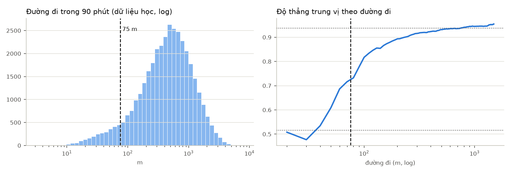
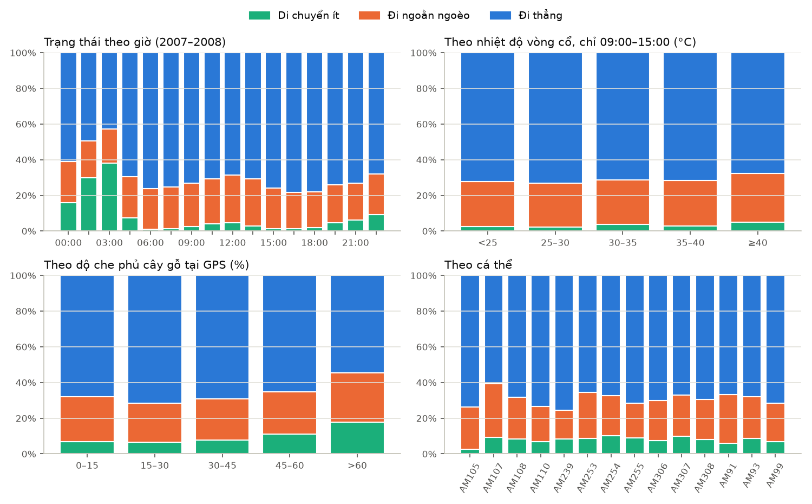

# EDA trạng thái chuyển động (cửa sổ 90 phút)

Dữ liệu: 80,487 cửa sổ 90 phút của 14 voi. Chia theo thời gian: **fit** 08/2007–06/2008
(39,252), **validation** 07–12/2008 (23,299), **2009** (17,923, chỉ để đối chiếu,
không dùng cho EDA hay chọn ngưỡng). Số liệu dưới đây là 2007–2008, chỉ cửa sổ đủ chất lượng.

## 1. Đại lượng đo được

| Đại lượng | Cách tính |
|---|---|
| Đường đi | Tổng độ dài các bước GPS trong 90 phút tới, quy về 90 phút |
| Dịch chuyển | Khoảng cách thẳng từ điểm đầu tới điểm cuối cửa sổ |
| Độ thẳng | Dịch chuyển ÷ đường đi (1 = đi thẳng, gần 0 = quay về chỗ cũ) |
| Đổi hướng | Trung bình góc rẽ giữa các bước dài ≥ 20 m |

Trung vị đường đi 410 m / 90 phút; độ thẳng trung vị 0.92.
Phân bố đường đi (log) **chỉ có một đỉnh**: không có ranh giới tự nhiên giữa "nghỉ" và "đi".

## 2. Ngưỡng nhãn (học từ fit)

- **Di chuyển ít: đường đi < 75 m.** Ở đường đi < 50 m, độ thẳng trung vị chỉ 0.52
  (gần nhiễu GPS: mô phỏng voi đứng yên với sai số 10 m cho đường đi ~50 m, độ thẳng ~0,33). Từ ~200 m trở lên độ thẳng ổn
  định quanh 0.94. Ngưỡng là nơi độ thẳng đi được nửa đường giữa hai mức.
- **Đi ngoằn ngoèo: có di chuyển và độ thẳng < 0.81** (25% cửa sổ có di chuyển kém thẳng nhất). Độ thẳng
  của các cửa sổ có di chuyển lệch mạnh về 1 và không tách hai nhóm (GMM chỉ tách "rất thẳng" và "khá thẳng"), nên dùng
  phân vị và kiểm tra độ nhạy.
- **Đi thẳng: còn lại.**

Tỉ lệ 2007–2008: Di chuyển ít 8.0%, Đi ngoằn ngoèo 22.8%, Đi thẳng 69.3%.
Cửa sổ có cùng trạng thái với 90 phút trước: 57.6%.

**Độ nhạy** (đổi ngưỡng, so với nhãn mặc định):

| Ngưỡng đường đi | Phân vị độ thẳng | Ngưỡng độ thẳng | Di chuyển ít | Đi ngoằn ngoèo | Đi thẳng | Trùng nhãn mặc định |
|---:|---:|---:|---:|---:|---:|---:|
| 56 m | 20% | 0.76 | 5.5% | 19.0% | 75.5% | 92.4% |
| 56 m | 25% | 0.81 | 5.5% | 23.5% | 70.9% | 96.8% |
| 56 m | 33% | 0.86 | 5.5% | 30.9% | 63.5% | 91.2% |
| 75 m | 20% | 0.77 | 8.0% | 18.3% | 73.8% | 95.5% |
| 75 m | 25% | 0.81 | 8.0% | 22.8% | 69.3% | 100.0% |
| 75 m | 33% | 0.86 | 8.0% | 29.9% | 62.1% | 92.8% |
| 94 m | 20% | 0.78 | 10.3% | 17.7% | 72.1% | 94.0% |
| 94 m | 25% | 0.82 | 10.3% | 22.0% | 67.7% | 97.0% |
| 94 m | 33% | 0.86 | 10.3% | 29.0% | 60.7% | 90.0% |

## 3. Đối chiếu

### Giờ trong ngày
| Giờ | Di chuyển ít | Đi ngoằn ngoèo | Đi thẳng | Số cửa sổ |
|---|---:|---:|---:|---:|
| 00:00 | 15.8% | 23.3% | 60.9% | 3,705 |
| 01:30 | 29.9% | 20.6% | 49.6% | 3,445 |
| 03:00 | 38.2% | 19.1% | 42.7% | 3,372 |
| 04:30 | 7.3% | 23.3% | 69.4% | 3,493 |
| 06:00 | 0.9% | 22.9% | 76.2% | 3,690 |
| 07:30 | 1.4% | 23.4% | 75.2% | 3,821 |
| 09:00 | 2.5% | 24.4% | 73.1% | 3,817 |
| 10:30 | 4.2% | 25.1% | 70.7% | 3,729 |
| 12:00 | 4.5% | 26.9% | 68.6% | 3,723 |
| 13:30 | 2.9% | 26.4% | 70.8% | 3,714 |
| 15:00 | 1.4% | 22.8% | 75.8% | 3,700 |
| 16:30 | 1.2% | 20.6% | 78.2% | 3,728 |
| 18:00 | 1.9% | 20.0% | 78.0% | 3,797 |
| 19:30 | 4.6% | 21.5% | 73.9% | 3,834 |
| 21:00 | 6.2% | 20.7% | 73.1% | 3,837 |
| 22:30 | 9.2% | 22.9% | 67.9% | 3,802 |

### Nhiệt độ vòng cổ (mọi giờ)
| °C | Di chuyển ít | Đi ngoằn ngoèo | Đi thẳng | Số cửa sổ |
|---|---:|---:|---:|---:|
| <20 | 14.4% | 19.7% | 65.8% | 7,476 |
| 20–25 | 12.4% | 22.5% | 65.2% | 16,151 |
| 25–30 | 7.1% | 23.1% | 69.8% | 15,123 |
| 30–35 | 2.9% | 23.7% | 73.4% | 11,561 |
| ≥35 | 2.6% | 24.0% | 73.5% | 8,896 |

Nhiệt độ và giờ đi cùng nhau. **Chỉ xét 09:00–15:00** để giảm ảnh hưởng của giờ:
| °C | Di chuyển ít | Đi ngoằn ngoèo | Đi thẳng | Số cửa sổ |
|---|---:|---:|---:|---:|
| <25 | 2.6% | 25.1% | 72.3% | 1,877 |
| 25–30 | 2.3% | 24.5% | 73.2% | 3,343 |
| 30–35 | 3.6% | 25.2% | 71.2% | 6,823 |
| 35–40 | 3.0% | 25.3% | 71.7% | 6,308 |
| ≥40 | 5.1% | 27.1% | 67.8% | 332 |

### Độ che phủ cây gỗ (chỉ GPS có giá trị thật; thiếu 5.2%)
| % | Di chuyển ít | Đi ngoằn ngoèo | Đi thẳng | Số cửa sổ |
|---|---:|---:|---:|---:|
| 0–15 | 6.9% | 25.1% | 68.0% | 2,851 |
| 15–30 | 6.6% | 21.9% | 71.5% | 16,739 |
| 30–45 | 7.7% | 23.1% | 69.2% | 28,178 |
| 45–60 | 11.1% | 23.6% | 65.3% | 7,985 |
| >60 | 17.9% | 27.6% | 54.5% | 352 |

Chỉ ban đêm (00:00–04:30):
| % | Di chuyển ít | Đi ngoằn ngoèo | Đi thẳng | Số cửa sổ |
|---|---:|---:|---:|---:|
| 0–15 | 21.3% | 21.9% | 56.8% | 629 |
| 15–30 | 23.3% | 21.3% | 55.4% | 3,093 |
| 30–45 | 28.0% | 21.1% | 50.9% | 4,843 |
| 45–60 | 37.5% | 20.8% | 41.7% | 1,323 |
| >60 | 48.8% | 24.4% | 26.8% | 41 |

### Mùa (lịch quy ước)
| Mùa | Di chuyển ít | Đi ngoằn ngoèo | Đi thẳng | Số cửa sổ |
|---|---:|---:|---:|---:|
| Mùa khô | 9.1% | 20.7% | 70.3% | 29,798 |
| Mùa mưa | 6.8% | 24.9% | 68.3% | 29,409 |

### Cá thể
| Voi | Di chuyển ít | Đi ngoằn ngoèo | Đi thẳng | Số cửa sổ |
|---|---:|---:|---:|---:|
| AM105 | 2.7% | 23.5% | 73.8% | 943 |
| AM107 | 9.2% | 30.2% | 60.6% | 1,908 |
| AM108 | 8.4% | 23.3% | 68.3% | 2,991 |
| AM110 | 6.8% | 19.9% | 73.3% | 5,646 |
| AM239 | 8.4% | 16.2% | 75.4% | 3,974 |
| AM253 | 8.8% | 25.8% | 65.4% | 6,604 |
| AM254 | 10.2% | 22.3% | 67.4% | 3,807 |
| AM255 | 8.9% | 19.6% | 71.5% | 5,838 |
| AM306 | 7.3% | 22.5% | 70.2% | 3,191 |
| AM307 | 9.8% | 23.2% | 67.0% | 4,185 |
| AM308 | 8.0% | 22.5% | 69.5% | 2,840 |
| AM91 | 6.1% | 27.1% | 66.8% | 7,433 |
| AM93 | 8.7% | 23.2% | 68.1% | 3,084 |
| AM99 | 6.8% | 21.5% | 71.7% | 6,763 |

Trung vị đường đi theo cá thể: AM105 610 m, AM107 376 m, AM108 446 m, AM110 488 m, AM239 390 m, AM253 391 m, AM254 304 m, AM255 369 m, AM306 422 m, AM307 318 m, AM308 439 m, AM91 457 m, AM93 449 m, AM99 444 m.

### Quan hệ với nguồn nước trong từng trạng thái
| Trạng thái | Dịch chuyển < 100 m | Khoảng cách ít đổi | Ra xa nước | Về gần nước | Khoảng cách tới nước (trung vị) |
|---|---:|---:|---:|---:|---:|
| Di chuyển ít | 100.0% | 0.0% | 0.0% | 0.0% | 983 m |
| Đi ngoằn ngoèo | 23.2% | 28.9% | 25.0% | 22.9% | 725 m |
| Đi thẳng | 2.4% | 24.9% | 38.1% | 34.6% | 831 m |

## 4. Chất lượng dữ liệu

- Cửa sổ bị loại vì < 3 fix, khoảng trống > 60 phút hoặc bước GPS lỗi: 5.3%.
- Số fix trong cửa sổ tương lai: {2: 1970, 3: 4425, 4: 50619, 5: 5537}.
- Điểm GPS thiếu làm đường đi ngắn đi: trung vị 415 m khi đủ fix 30 phút,
  361 m khi có khoảng trống 60 phút. Vì vậy tuổi điểm GPS và khoảng trống được đưa vào làm
  feature kiểm soát chất lượng.
- Tuổi điểm GPS tại mốc (phút): {0: 50264, 1: 383, 2: 392, 3: 347, 4: 332, 5: 304}.

## Giới hạn
Nhãn là trạng thái hình học của quỹ đạo GPS (đi ít / đi ngoằn ngoèo / đi thẳng), **không** phải ăn, ngủ hay uống.
Cửa sổ 90 phút chỉ có ~4 fix nên độ thẳng thô; ngưỡng là quy ước có cơ sở dữ liệu, không phải ngưỡng sinh học.
